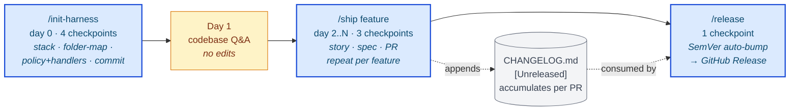

# Project Life Cycle — Guide

> The full picture: what this skill does, when to use it, how the workflow runs, and a
> file-by-file [repo map](#repository-map). For install steps see the [README](README.md#setup).

## TL;DR — the 3-command lifecycle



- **`/init-harness`** — bootstrap a fresh / existing project. Detects stack, generates `CLAUDE.md` + `folder-map` + policy keys + `.claude/commands/` + `.claude/handlers/` scaffolds. Idempotent; merges into existing files. Run once per project.
- **`/ship <feature>`** — ship one user-observable feature end-to-end. Chains researcher → story → spec → BE-builder → FE-builder → acceptance verifier → validator → fix loop → PR. Run N times across the milestone.
- **`/release`** — cut a SemVer release. Computes bump from `CHANGELOG.md` `[Unreleased]`, renames the section, bumps all six plugin manifests (Claude · Qoder · CodeBuddy), validates, commits, tags, pushes, verifies GitHub Release. Run when `[Unreleased]` has accumulated enough user-visible content.
- **`/builder-profile`** (opt-in, auxiliary — not part of the core pipeline) — read your own local Claude Code transcripts and write a markdown snapshot of how you actually use an AI coding agent to `~/.claude/builder-profile.md`. 100% local (no upload). Gated pipeline: deterministic stats → evidence gate → cold-read → adversarial verify → independent verification. Default descriptive — a mirror (operating modes, signature moves, honest about what couldn't be measured), not a score card; 1-10 scores only behind `--scores`. Independent of `/init-harness → /ship → /release`.

Between commands: every PR updates `[Unreleased]` + carries one category label + uses a Conventional Commits title (see [`CONTRIBUTING.md`](CONTRIBUTING.md)). The Validator (cadence step 2, read-only) catches builder lies; the Acceptance Verifier (cadence step 1.5) writes one test per AC; deterministic handlers (`.claude/handlers/`) inject auth / secrets / pre-flight lint / migration safety before the LLM ever sees them.

The workflow is bounded by **two gates**:

- **Entry — the intent-gate front door** (`references/intent-gate.md`): every fresh request is classified → intent confirmed → a fuzzy ask ("this is wrong, fix it") reframed into a precise prompt with a named oracle, *before any code*. Classification runs on two orthogonal axes:
  - **Size** — how much ceremony: trivial → inline / medium → cadence / large → brainstorm.
  - **Archetype** — what shape the work is: Builder / Prototyper / Sweeper / Grower / Maintainer (reshapes the chain that Size routed into).
- **Exit — the deterministic close gate** (`references/close-gate.md`): nothing is "done" until `task-done` / `phase-done` confirms the wrap-up artifacts actually exist (journal, fresh test evidence, handoff, CHANGELOG, smoke) — enforced by a pre-push hook the model can't talk its way around.

### Do I type the commands, or does Claude?

Short answer: **you don't have to type anything to get the workflow.** The `project-lifecycle` skill auto-loads when Claude detects relevant work, and Claude can run the full cadence inline. The slash commands are a *convenience entry point*, not a requirement.

- **`/ship`** — Claude can run this whole flow inline. You can type `/ship <feature>` as a shortcut, but you can also just say "build X" and Claude runs the same 6-step cadence. When in doubt, Claude should offer to proceed and tell you so.
- **`/init-harness`** — type it once when bootstrapping a project (or tell Claude "set this project up" and it runs the same steps).
- **`/release`** — recommended to type yourself, because it tags + pushes + publishes (irreversible). Claude will ask before doing it either way.

If Claude ever names a command without telling you whether *you* need to act, that's a bug in how it's communicating — ask "do I need to run that, or will you?"

## What it is

A **process layer**, not a code generator. It wraps the underlying [`superpowers:*`](https://github.com/obra/superpowers) skills (brainstorming, writing-plans, subagent-driven-development, TDD, code review, debugging, finishing-branch, worktrees) with conventions that make AI-driven multi-phase development auditable.

If you ship features through an AI agent and don't want to re-explain your dev process every new project, this skill is the contract.

**Framed as a harness.** Borrowing Tejas Kumar's vocabulary: this skill IS an agent harness — the deterministic scaffolding around the LLM that grounds it in reality. Tool registry (subagents: researcher / story-writer / spec-writer / BE-builder / FE-builder / acceptance-verifier / validator / code-reviewer / journal-writer), guardrails (Red Flags + Mandatory Conventions), context management (`/clear` discipline + handoff + RESUME), agent loop (per-phase + per-task cadence + `/ship` orchestrator), verify step (acceptance verifier + validator + dual-track smoke), deterministic handlers (auth / secret / lint / migration safety injected as pre-steps), and lie detection (validator cross-references builder claims against the diff). Full mapping in `SKILL.md` §"This skill IS an agent harness".

## When to use

| Situation | Use this skill? |
|---|---|
| Bootstrap a fresh / existing project to use this skill | ✅ Yes — run `/init-harness` (detects stack, generates CLAUDE.md / folder-map / handlers / commands) |
| Fresh project / new milestone / multi-task feature | ✅ Yes — full workflow |
| Decisions that need research before choosing | ✅ Yes — brainstorm + research gate |
| One vertical-slice feature inside an active phase | ✅ Yes — run `/ship <feature>` |
| Cut a release after one+ shipped phases | ✅ Yes — run `/release` (auto-bumps SemVer from `[Unreleased]` content) |
| New contributor (human or AI agent) joining a project | ✅ Yes — Day 1 = codebase Q&A only per `references/onboarding.md` |
| Typo fix / single-file polish / one-off bug | ❌ Skip — just do it inline |
| Pure refactor / dep bump / docs-only | ❌ Skip the full workflow |

Full workflow burns ~100–300 K tokens per phase. Earn it; don't spend it on trivial work.

## Using it

**Auto-trigger** — invoked when Claude detects:
- `RESUME.md` / `iteration-journal.md` absent (fresh project)
- Planning a new milestone
- Per-phase work with spec / plan / journal artifacts
- Milestone close

**Explicit invoke** — "use the `project-lifecycle` skill".

**Bootstrap a project** — `/init-harness`. Detects the project's stack (language / framework / DB / queue / auth / multi-tenant / layer split / CI), generates `CLAUDE.md` with folder-map + policy keys, seeds `CONTEXT.md` / `RESUME.md` / `iteration-journal.md` / `CHANGELOG.md` placeholders, scaffolds project-shared `.claude/commands/` (test-phase / start-stack / db-snapshot) and `.claude/handlers/` (pre-flight lint / secret leak / migration safety / tenant isolation / auth). Idempotent — merges into existing files; never overwrites without explicit confirm. 4 human checkpoints. `--refresh` re-detects against current code; `--dry-run` reports without writing.

**Day 1 onboarding** (new contributor — human or AI) — codebase Q&A only, no edits. Read CLAUDE.md / CONTEXT.md / RESUME.md / `docs/iteration-journal.md` / `ls docs/superpowers/` / `ls .claude/commands/`. Then run the project locally + smoke the last shipped phase. Full protocol in `references/onboarding.md`. Day 2+ moves to small `/ship`.

**Vertical-slice feature** — `/ship <one-line feature>`. Chains researcher → story → spec → BE/FE builders → acceptance verifier → validator → fix loop → PR. 3 human checkpoints: approve story, approve spec, approve PR. Everything else runs unattended.

**Cut a release** — `/release` (or `/release minor` / `patch` / `major` to override the auto-inferred bump). Computes the SemVer bump from `CHANGELOG.md` `[Unreleased]` content, renames the section to `[X.Y.Z] — YYYY-MM-DD`, bumps all six SemVer plugin manifests, validates, commits, tags, pushes, and verifies the GitHub Release landed. 1 human checkpoint (confirm version). Full spec in `references/release-process.md`. Do NOT hand-edit `CHANGELOG.md` / `.claude-plugin/*` / git tags for releases — `/release` is the single entry point.

**Output artifacts** — all live under `docs/`:

| Artifact | Path |
|---|---|
| Domain glossary | `CONTEXT.md` (or `CONTEXT-MAP.md` + per-context `CONTEXT.md`) |
| ADRs | `docs/adr/NNNN-<slug>.md` |
| Brainstorm Q&A log | `docs/brainstorming-qa-log.md` (append-only, TOC at top) |
| User story | `docs/superpowers/specs/YYYY-MM-DD-phase-X.Y-<slug>-user-story.md` |
| Phase spec | `docs/superpowers/specs/…-design.md` |
| Phase PRD (opt-in) | `docs/superpowers/specs/…-prd.md` |
| Phase plan | `docs/superpowers/plans/…` |
| Research notes | `docs/research/…` |
| Handoff | `docs/handoff/YYYY-MM-DD-phase-X.Y-handoff.md` |
| Journal | `docs/iteration-journal.md` (append-only, TOC at top) |
| Milestone state | `docs/RESUME.md` |
| Whole-plan map | `docs/ROADMAP.md` (milestone table + status, updated at milestone boundaries) |
| PR drafts (body + comment) | `docs/pr-drafts/YYYY-MM-DD-phase-X.Y-{pr-body,pr-comment}.md` |

## Project layering

This skill = **universal** workflow. Your project's `CLAUDE.md` carries **project-specific** rules only: stack, audience, glossary pointer, escalation categories. Anything cross-project belongs here — propose via PR.

Skill-aware policy keys in `CLAUDE.md` (all optional, all skip per-phase opt-in questions when set):

```yaml
domain-docs: ./CONTEXT.md         # or ./CONTEXT-MAP.md
html-policy: ask                  # ask | always-md | always-html
smoke-mode: guided                # ask | self | guided (guided recommended)
comprehension: off                # off | lite | full (anti-offloading co-discovery round)
close-gate: per-task              # per-task | pr-boundary (where the human-blocking approval sits)
intent-gate: assume               # ask | assume | off (front-door intent confirmation)
archetype: auto                   # auto | builder | prototyper | sweeper | grower | maintainer | off (work-shape axis; auto = infer + one-tap confirm per request)
folder-map:                       # required when /ship splits BE/FE builders
  backend:  [src/api/, src/services/, src/db/, migrations/, tests/api/]
  frontend: [src/components/, src/pages/, src/hooks/, tests/components/]
  shared:   [src/types/]
```

Full key list + defaults in `references/output-format.md` and `references/builder-split.md`.

## Development

**The repo is the single source of truth.** Users consume the skill as a versioned plugin (marketplace install → plugin cache); changes reach them through releases. There is no separate "live" copy to keep in sync.

**Trying unreleased changes** — load the working tree directly for one session:

```bash
claude --plugin-dir /path/to/project-life-cycle
```

- The working-tree plugin shadows the installed marketplace version for that session (same name → local wins).
- Per-session flag: a session launched without it runs the released cache version. Confirm what's loaded via `/plugins`.
- SKILL.md / reference text edits apply immediately; `hooks/` and `commands/` changes need `/reload-plugins` (or a restart).

Adding a new slash command: author it under `commands/` → append the filename to `scripts/commands-manifest.txt` → commit. Validator rejects manifest ↔ disk mismatch (no orphans either way).

**Validation** — `python3 scripts/validate.py` checks manifest JSON, marketplace ↔ plugin name agreement, SKILL.md frontmatter, every reference link, every command's frontmatter + manifest reconciliation, and UTF-8 on every `.md`.

**Release** — type `/release` in Claude Code. One human checkpoint (confirm version + bump). The command handles everything: SemVer bump inference, CHANGELOG section rename, manifest bumps, validate, commit, tag, push, workflow watch, release verification. Full spec in `skills/project-lifecycle/references/release-process.md`; SemVer rules + retroactive-tag recovery in [`CONTRIBUTING.md`](CONTRIBUTING.md).

Manual fallback (only when `/release` is unavailable or you're recovering from a failed run):

```bash
# 1. CHANGELOG: rename [Unreleased] → [X.Y.Z] — YYYY-MM-DD; add fresh [Unreleased] block
$EDITOR CHANGELOG.md
# 2. Bump all plugin manifests to the same version
$EDITOR .claude-plugin/marketplace.json .claude-plugin/plugin.json .qoder-plugin/plugin.json .qoder-plugin/marketplace.json .codebuddy-plugin/plugin.json .codebuddy-plugin/marketplace.json
git commit -am "chore(release): vX.Y.Z"
# 3. Tag + push
git tag vX.Y.Z && git push origin vX.Y.Z
```

`.github/workflows/release.yml` triggers on tag push → extracts the matching `## [X.Y.Z]` section from CHANGELOG as the release body → appends GitHub auto-notes (PR-label-grouped per `.github/release.yml`). Users upgrade with `claude plugin marketplace update` + `claude plugin update`.

**Every PR** must update `CHANGELOG.md` `[Unreleased]` AND carry exactly one category label AND use a Conventional Commits title — see [`CONTRIBUTING.md`](CONTRIBUTING.md) for the full taxonomy + exemptions.

## Companion tools (optional, not bundled)

| Tool | Role |
|---|---|
| [superpowers](https://github.com/obra/superpowers) | **Required** — underlying skills called by name in `SKILL.md`. Without it, the workflow degrades to docs-only. |
| [RTK](https://github.com/rtk-ai/rtk) | Auto-compresses git/pytest/playwright output 60–90% via PreToolUse hook |
| [token-savior](https://github.com/Mibayy/token-savior) | MCP server for symbol-level codebase nav + persistent reasoning memory |
| [caveman](https://github.com/JuliusBrussee/caveman) | Prompt-level output compression plugin |

`references/cost-aware-behaviors.md` covers adopt-tier guidance + pure-discipline fallbacks for projects without these tools.

## Repository map

An annotated layout of the main surfaces of this repository, with a one-line note on each. Maintained by hand and may lag — `ls skills/project-lifecycle/references/` is authoritative. If you just want to install and use the skill, the [README](README.md) is enough; this section is for when you want to know what a specific file is for.

```
skills/project-lifecycle/
├── SKILL.md                              ← entry point + 10-step per-phase workflow
└── references/
    │
    │  ── onboarding + ergonomics (start here for new contributors) ──
    ├── onboarding.md                     Day 1 protocol — codebase Q&A only, no edits. Anchor checklist (CLAUDE.md / CONTEXT.md / RESUME.md / journal / .claude/commands/). Day 2+ gradient to /ship. Includes project-level .claude/commands/ schema for team-shared slash commands.
    ├── ergonomics.md                     Claude Code session habits — 5 to internalize: # memory append, ! bash mode, shift-tab auto-accept, escape interrupt, drag-drop multimodal. Full keybinding + claude -p SDK + multi-Claude parallelism reference.
    │
    │  ── per-phase building blocks ──
    ├── intent-gate.md                    the workflow FRONT DOOR — classify → confirm intent → reframe+sharpen on every fresh request; turns a fuzzy ask into a precise prompt with a named oracle; doubles as machinery triage (trivial→inline / medium→cadence / large→brainstorm)
    ├── changelog.md                      CHANGELOG.md (Keep a Changelog 1.1.0) discipline + PR label taxonomy + per-PR rules + SemVer bump + release flow. Universal across every project this skill touches.
    ├── brainstorm-research-protocol.md   per-question 7-step loop (frame → research → 1st rec → blind 2nd verifier → compare → evidence-tag → surface) + Mode A interactive / Mode B batch
    ├── context-md.md                     ubiquitous-language glossary (CONTEXT.md / CONTEXT-MAP.md) — DDD-style domain anchor
    ├── adr.md                            Architectural Decision Records (3-criteria gate: hard-to-reverse AND surprising AND real-tradeoff)
    ├── prd-template.md                   optional product-facing PRD when stakeholders include non-engineers
    ├── user-story.md                     MANDATORY for user-observable phases — numbered acceptance criteria + Out-of-Scope + Open Questions + pre-declared Contingencies (when X → do Y, injected into builder prompts) + optional machine-checkable Invariants; signed off BEFORE spec
    ├── issue-breakdown.md                optional Step 4b — split plan into vertical-slice tracer-bullet issues
    ├── roadmap.md                        docs/ROADMAP.md whole-plan map — one-sentence goal + milestone table + status legend (✅▶☐⏸✗); updated at every milestone boundary; the ROADMAP-vs-RESUME split + the status-file ring close protocol (active + 2 most recent closed entries; oldest moves verbatim to a dedicated archive)
    ├── parallel-work.md                  WIP=1 (one active code track per project) + the sidecar exception (doc-only research parallel to the active track) + the single-writer rule (one session holds the pen for the status/roadmap file)
    │
    │  ── per-task cadence (6 steps) ──
    ├── cadence.md                        full per-task cadence: implementer(s) → acceptance verifier → validator (with lie-detection step 0) → code quality → fixup → journal
    ├── builder-split.md                  backend-builder + frontend-builder w/ folder-scoped tools + Builder Summary contract (API handoff)
    ├── verify-loop.md                    feedback-loop pattern (3 canonical loops: test / visual screenshot / runtime curl) — give the LLM a way to check its own work; cap iterations; without it, the LLM self-grades and lies
    ├── deterministic-handlers.md         harness-injected pre-step pattern (auth / secret / lint / migration safety / tenant isolation). Pure code, fires every loop iteration before LLM, injects [HARNESS] message when it acts. 6 canonical handler examples + dynamic-handlers path
    ├── journal-schema.md                 6-section journal entry template
    ├── defer-vs-fix.md                   triage rule for review findings
    ├── diagnose-loop.md                  hard-bug discipline: feedback loop → ranked hypotheses → fix + regression. Iron Law + 3-Fix Rule
    ├── close-gate.md                     deterministic done-gate — task-done / phase-done checks (journal header / fresh test-evidence / handoff sections / CHANGELOG touch / smoke / ROADMAP), portable script + manifest, pre-push-hook wiring (the un-bypassable layer) + the close-gate policy key (per-task | pr-boundary — where the human-blocking approval sits, with the self-certification attack surface written out)
    ├── review-record.md                  trustworthy AI review — reviewer dispatch constraints (fresh context / read-only / tier asymmetry / refute-first / file:line evidence gate / computed verdicts), the bidirectional review record on the PR (reviewer report verbatim + builder per-finding response), finding→fix rules (reviewer snippets are untrusted input; mandatory final-pass), coverage-window check
    │
    │  ── delivery + CI ──
    ├── smoke-tracks.md                   dual-track smoke contract (Track A manual + Track B Playwright)
    ├── handoff-template.md               8-section phase delivery doc + PR-body appendix
    ├── findings-tier.md                  S1/S2/S3 triage
    ├── ci-cd-gates.md                    pre-commit / PR-time CI / branch protection — includes Pattern E billing-blocked fallback
    ├── copilot-review-loop.md            per-PR @copilot review loop + per-finding inline-reply convention
    ├── pr-comment-template.md            9-layer PR-comment audit narrative (golden/negative-path demo / before-after / cost / perf / findings tier / gate output / reviewer asks / what's next) + the review-record companion comments + draft-first workflow + folded raw evidence
    ├── research-gate.md                  when online research is required before deciding
    │
    │  ── output discipline ──
    ├── output-format.md                  MD-canonical force list + HTML opt-in nodes + CLAUDE.md policy keys (html-policy / smoke-mode / comprehension / close-gate)
    ├── html-companion-template.md        HTML companion structure + style presets (default-cool / kami-parchment / swiss-grid / xhs-pastel) + 4 anti-AI-slop hard rules
    ├── html-companion-skeleton.html      copy-paste skeleton for spec/design HTML companions
    ├── document-indexing.md              TOC convention for long-lived append-only docs
    │
    │  ── release ──
    ├── release-process.md                full /release spec — artifact inventory, SemVer bump table, per-release file updates, commit + tag conventions, workflow behavior on tag push, verification checklist, failure-mode recovery, retroactive-tag flow, cadence guidance
    │
    │  ── bootstrap ──
    ├── init-harness.md                   full /init-harness spec — detection signal table (language/framework/DB/queue/auth/tenancy/timezone/layer-split/CI), merge strategy per artifact, handler scaffold templates per stack, generated .claude/commands/ skeleton, --refresh + --dry-run modes, idempotency guarantees. Realizes Tejas's "dynamic harnesses" vision.
    │
    │  ── meta ──
    ├── harness-primitives.md             native Claude Code primitives → skill-node map (frontmatter hooks / SessionStart:resume / dynamic Workflows / run_in_background parallel reviewers / worktree isolation / AskUserQuestion / plan mode / goal,context,branch) + verification provenance. Documents the self-enforcing layer the skill now ships.
    ├── cost-aware-behaviors.md           per-token leverage rules + tool-adopt tiers (RTK / token-savior / caveman)
    ├── comprehension-co-discovery.md     opt-in anti-cognitive-offloading round (comprehension policy key) — one why-question per phase on the validated diff; discovery-not-judgment, no scoreboard
    ├── builder-profile.md                /builder-profile mechanism — gated pipeline (deterministic stats → evidence gate → cold-read → adversarial verify → independent verification) + framing-safety rules + report shape
    ├── milestone-done.md                 closing-the-milestone gate
    ├── self-update-flow.md               how the AI updates this skill itself
    └── origin.md                         pilot history

hooks/                                     ← self-enforcing frontmatter hooks — fire only while the skill is active (see references/harness-primitives.md)
├── guard.sh                               PreToolUse:Bash — blocks --no-verify and direct pushes to main
├── close-gate-nudge.sh                    Stop/SubagentStop — throttled close-gate reminder, only on a feat/phase-* branch with pending wrap-up
├── inject-resume.sh.template              SessionStart:resume RESUME-injection template (installed per-project by /init-harness)
└── test-hooks.sh                          deterministic test gate for the hook scripts (run before committing hook changes)

commands/                                  ← slash commands shipped with the skill (curated via scripts/commands-manifest.txt)
├── init-harness.md                        /init-harness — bootstrap a project to use this skill (detect stack + generate CLAUDE.md / folder-map / policy keys / .claude/commands/ / .claude/handlers/; idempotent merge; 4 human checkpoints)
├── ship.md                                /ship — vertical-slice orchestrator (researcher → story → spec → BE → FE → verifier → validator → fix → PR; 3 human checkpoints)
├── release.md                             /release — automated release cut (computes SemVer bump from CHANGELOG [Unreleased], renames section, bumps all plugin manifests, validates, commits, tags, pushes, verifies GitHub Release; 1 human checkpoint)
└── builder-profile.md                     /builder-profile — opt-in local AI-coding usage snapshot (reads ~/.claude/projects transcripts → ~/.claude/builder-profile.md; deterministic stats + cold-read + independent verification; 100% local; auxiliary, not part of the core pipeline)

CHANGELOG.md                              Keep a Changelog 1.1.0 — per-version log of what shipped. [Unreleased] at top.
CONTRIBUTING.md                           Commit/PR/CHANGELOG/label discipline applied at the repo boundary.
.github/release.yml                       PR-label-driven auto release notes (label categories: breaking / feature / cadence / commands / docs / fix / ci / chore / dependencies).
.github/workflows/release.yml             Tag-driven GitHub Release workflow — extracts matching CHANGELOG section as body + appends GitHub auto-notes.
```
