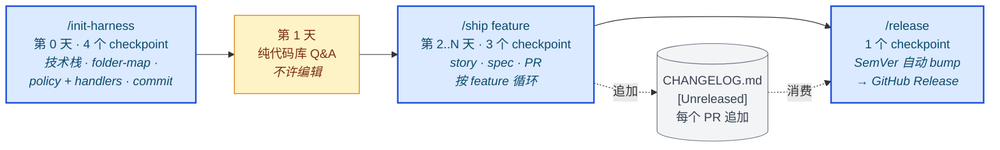

# project-lifecycle

**[English](README.md)** · 简体中文

一个 [Claude Code](https://docs.claude.com/en/docs/claude-code) skill，强制执行 **可追溯的多阶段软件项目工作流** —— 由 3 个斜杠命令（`/init-harness` → `/ship` → `/release`）和"10 步 per-phase / 6 步 per-task"纪律驱动。一个 skill，所有项目，同一套契约。

所有产物都 **以 Markdown 为权威**、**走 git 留痕**：spec、plan、user story、journal、handoff、PR 描述、CHANGELOG 全部是 `docs/` 和仓库根目录下的 markdown 文件。无隐藏状态。

**变更日志** → [`CHANGELOG.md`](CHANGELOG.md)（Keep a Changelog 1.1.0 格式）。**如何贡献** → [`CONTRIBUTING.md`](CONTRIBUTING.md)。**发布记录** → [GitHub Releases](https://github.com/Victoriakaey/project-life-cycle/releases)（CHANGELOG + PR label 自动生成；通过 `/release` 切版）。

## TL;DR — 3 命令生命周期



- **`/init-harness`** —— bootstrap 新项目或既有项目。检测技术栈，生成 `CLAUDE.md` + `folder-map` + policy keys + `.claude/commands/` + `.claude/handlers/` 脚手架。幂等；已存在文件走 merge。每个项目运行一次。
- **`/ship <feature>`** —— 端到端交付一个用户可观察的 feature。链路：researcher → story → spec → BE-builder → FE-builder → acceptance verifier → validator → fix 循环 → PR。一个 milestone 内运行 N 次。
- **`/release`** —— 切一个 SemVer release。从 `CHANGELOG.md` `[Unreleased]` 推断 bump、重命名 section、bump 两个 `.claude-plugin/` 清单、validate、commit、tag、push、验证 GitHub Release 落地。当 `[Unreleased]` 积累了足够的用户可见内容时运行。

命令之间：每个 PR 都要更新 `[Unreleased]` + 带恰好一个 category label + 用 Conventional Commits 标题（详见 [`CONTRIBUTING.md`](CONTRIBUTING.md)）。Validator（cadence step 2，只读）抓 builder 说谎；Acceptance Verifier（cadence step 1.5）每条 AC 写一个测试；deterministic handlers（`.claude/handlers/`）在 LLM 介入之前注入 auth / secrets / pre-flight lint / migration safety。

### 命令是我敲，还是 Claude 敲？

简答：**你不用敲任何命令就能拿到整个工作流。** `project-lifecycle` skill 在 Claude 检测到相关工作时自动加载，Claude 可以内联跑完整 cadence。斜杠命令是*便捷入口*，不是必需。

- **`/ship`** —— Claude 可以内联跑完。你可以敲 `/ship <feature>` 当快捷方式，也可以直接说"做 X"，Claude 跑同样的 6 步 cadence。拿不准时 Claude 应该主动提议"我现在帮你做？"并说清楚。
- **`/init-harness`** —— bootstrap 项目时敲一次（或者跟 Claude 说"把这个项目设置好"，它跑同样的步骤）。
- **`/release`** —— 建议你自己敲，因为它会 tag + push + 发布（不可逆）。无论哪种方式 Claude 都会先问你确认。

如果 Claude 提到某个命令却没告诉你*你*要不要动手，那是它沟通方式的 bug —— 直接问"这个要我跑，还是你跑？"

## 这是什么

一个 **流程层**，不是代码生成器。它把底层的 [`superpowers:*`](https://github.com/obra/superpowers) skills（brainstorming、writing-plans、subagent-driven-development、TDD、code review、debugging、finishing-branch、worktrees）用一套约定包起来，让 AI 驱动的多阶段开发可审计。

如果你通过 AI agent 交付 feature 且不想每个新项目都重新解释一遍开发流程，这个 skill 就是那份契约。

**以 harness 视角理解。** 借用 Tejas Kumar 的术语：这个 skill 本身就是一个 agent harness —— LLM 周围那层把模型固定在现实里的确定性脚手架。Tool registry（subagent：researcher / story-writer / spec-writer / BE-builder / FE-builder / acceptance-verifier / validator / code-reviewer / journal-writer）、guardrails（Red Flags + Mandatory Conventions）、context management（`/clear` 纪律 + handoff + RESUME）、agent loop（per-phase + per-task cadence + `/ship` orchestrator）、verify step（acceptance verifier + validator + dual-track smoke）、deterministic handlers（auth / secret / lint / migration safety 作为 pre-step 注入）、lie detection（validator 把 builder 的声明对照 diff 核对）。完整映射见 `SKILL.md` §"This skill IS an agent harness"。

## 什么时候用

| 场景 | 用这个 skill？ |
|---|---|
| Bootstrap 新项目或既有项目接入 skill | ✅ 用 —— 跑 `/init-harness`（检测技术栈，生成 CLAUDE.md / folder-map / handlers / commands） |
| 新项目 / 新 milestone / 多任务 feature | ✅ 用 —— 完整工作流 |
| 决策前需要 research | ✅ 用 —— brainstorm + research gate |
| 当前 phase 里的一个 vertical-slice feature | ✅ 用 —— 跑 `/ship <feature>` |
| 累计若干 phase 后切一个 release | ✅ 用 —— 跑 `/release`（从 `[Unreleased]` 内容自动推断 SemVer） |
| 新人（人类 / AI agent）加入项目 | ✅ 用 —— 第 1 天纯 Q&A，按 `references/onboarding.md` |
| 改个 typo / 单文件抛光 / 一次性 bug | ❌ 跳过 —— 直接动手 |
| 纯重构 / 依赖升级 / 仅文档 | ❌ 跳过完整工作流 |

完整工作流一个 phase 消耗约 100–300K token。值得花就花，琐碎工作别花。

## 内容

```
skills/project-lifecycle/
├── SKILL.md                              ← 入口 + 10 步 per-phase 工作流
└── references/
    │
    │  ── 入门 + 操作习惯（新贡献者从这里开始）──
    ├── onboarding.md                     第 1 天协议 —— 仅代码库 Q&A，不许编辑。锚点清单（CLAUDE.md / CONTEXT.md / RESUME.md / journal / .claude/commands/）。第 2 天起渐进到 /ship。包含项目级 .claude/commands/ schema（团队共享斜杠命令）。
    ├── ergonomics.md                     Claude Code 会话习惯 —— 5 个必修：# 写入 memory、! bash 模式、shift-tab 自动接受、escape 安全打断、拖拽多模态。完整键位 + claude -p SDK + 多 Claude 并行参考。
    │
    │  ── per-phase 构件 ──
    ├── changelog.md                      CHANGELOG.md（Keep a Changelog 1.1.0）纪律 + PR label 分类 + per-PR 规则 + SemVer bump + 发版流程。本 skill 适用于所有项目。
    ├── brainstorm-research-protocol.md   per-question 7 步循环（framing → research → 第 1 推荐 → 盲第 2 验证 → 对比 → evidence tag → 呈现）+ Mode A 交互 / Mode B 批处理
    ├── context-md.md                     ubiquitous-language 术语表（CONTEXT.md / CONTEXT-MAP.md）—— DDD 风格的领域锚点
    ├── adr.md                            架构决策记录 ADR（3 条标准 gate：难撤回 AND 反直觉 AND 有真权衡）
    ├── prd-template.md                   利益相关者含非工程师时可选的产品向 PRD
    ├── user-story.md                     用户可观察 phase 必须 —— 编号的验收标准 + Out-of-Scope + Open Questions；spec 之前签字
    ├── issue-breakdown.md                可选 Step 4b —— 把 plan 拆成 vertical-slice 曳光弹 issue
    │
    │  ── per-task cadence（6 步）──
    ├── cadence.md                        完整 per-task cadence：implementer(s) → acceptance verifier → validator（带 step 0 lie-detection）→ code quality → fixup → journal
    ├── builder-split.md                  backend-builder + frontend-builder 带 folder 作用域工具 + Builder Summary 契约（API handoff）
    ├── verify-loop.md                    反馈循环模式（3 种典型 loop：test / 视觉截图 / 运行时 curl）—— 给 LLM 一个自验工具；限制迭代次数；没有它，LLM 自评 + 撒谎
    ├── deterministic-handlers.md         harness 注入的 pre-step 模式（auth / secret / lint / migration safety / 多租户隔离）。纯代码、每个 loop 迭代在 LLM 之前触发、行动时注入 [HARNESS] 消息。6 个典型 handler 例子 + 动态 handler 2027 路径
    ├── journal-schema.md                 6-section journal 条目模板
    ├── defer-vs-fix.md                   review finding 分流规则
    ├── diagnose-loop.md                  硬 bug 纪律：反馈循环 → 排序假说 → 修 + 回归。Iron Law + 3-Fix Rule
    │
    │  ── 交付 + CI ──
    ├── smoke-tracks.md                   双轨 smoke 契约（Track A 手动 + Track B Playwright）
    ├── handoff-template.md               8-section phase 交付文档 + PR-body 附录
    ├── findings-tier.md                  S1/S2/S3 分流
    ├── ci-cd-gates.md                    pre-commit / PR-time CI / 分支保护 —— 含 Pattern E 计费阻断 fallback
    ├── copilot-review-loop.md            per-PR @copilot review 循环 + 逐 finding inline-reply 约定
    ├── research-gate.md                  什么时候决策前必须先 research
    │
    │  ── 输出纪律 ──
    ├── output-format.md                  MD-canonical 强制清单 + HTML 可选节点 + CLAUDE.md policy keys（html-policy / smoke-mode / domain-docs）
    ├── html-companion-template.md        HTML 伴生件结构 + 风格预设（default-cool / kami-parchment / swiss-grid / xhs-pastel）+ 4 条反 AI-slop 硬规则
    ├── html-companion-skeleton.html      spec/design HTML 伴生件的复制粘贴骨架
    ├── document-indexing.md              长寿 append-only 文档的 TOC 约定
    │
    │  ── 发版 ──
    ├── release-process.md                完整 /release 规范 —— 产物清单、SemVer bump 表、per-release 文件更新、commit + tag 约定、tag push 时 workflow 行为、验证清单、失败模式恢复、回溯 tag 流程、节奏指引
    │
    │  ── bootstrap ──
    ├── init-harness.md                   完整 /init-harness 规范 —— 检测信号表（语言/框架/DB/队列/auth/多租户/时区/层切分/CI）、每个产物的合并策略、按技术栈的 handler 脚手架模板、生成的 .claude/commands/ 骨架、--refresh + --dry-run 模式、幂等性保证。实现 Tejas 的"动态 harness"愿景。
    │
    │  ── 元 ──
    ├── harness-primitives.md             native Claude Code 原语 → skill 节点映射（frontmatter hooks / SessionStart:resume / dynamic Workflows / run_in_background 并行 reviewer / worktree 隔离 / AskUserQuestion / plan mode / goal,context,branch）+ 核实溯源。记录 skill 现在自带的自强制层。
    ├── cost-aware-behaviors.md           per-token 杠杆规则 + 工具采纳分级（RTK / token-savior / caveman）
    ├── milestone-done.md                 关闭 milestone 的 gate
    ├── self-update-flow.md               AI 如何更新这个 skill 自身
    └── origin.md                         pilot 历史

hooks/                                     ← 自强制 frontmatter hooks —— 仅在 skill active 时 fire（见 references/harness-primitives.md）
├── guard.sh                               PreToolUse:Bash —— 拦 --no-verify 和直接 push 到 main
├── close-gate-nudge.sh                    Stop/SubagentStop —— 节流 close-gate 提醒，仅在 feat/phase-* 分支有未完成 wrap-up 时
├── inject-resume.sh.template              SessionStart:resume RESUME 注入模板（由 /init-harness 按项目安装）
└── test-hooks.sh                          hook 脚本的确定性 pre-sync 测试 gate

commands/                                  ← skill 自带的斜杠命令（由 scripts/commands-manifest.txt 策展）
├── init-harness.md                        /init-harness —— bootstrap 项目接入 skill（检测技术栈 + 生成 CLAUDE.md / folder-map / policy keys / .claude/commands/ / .claude/handlers/；幂等合并；4 个 checkpoint）
├── ship.md                                /ship —— vertical-slice orchestrator（researcher → story → spec → BE → FE → verifier → validator → fix → PR；3 个 checkpoint）
└── release.md                             /release —— 自动化切版（从 CHANGELOG [Unreleased] 推断 SemVer bump、重命名 section、bump 两个 manifest、validate、commit、tag、push、验证 GitHub Release；1 个 checkpoint）

CHANGELOG.md                              Keep a Changelog 1.1.0 —— 按版本记录交付内容。[Unreleased] 在最上。
CONTRIBUTING.md                           Commit / PR / CHANGELOG / label 纪律，在 repo 边界落地。
.github/release.yml                       PR label 驱动的自动 release notes（label 类别：breaking / feature / cadence / commands / docs / fix / ci / chore / dependencies）。
.github/workflows/release.yml             Tag 驱动的 GitHub Release workflow —— 抽取匹配的 CHANGELOG section 作为 body + 追加 GitHub 自动 notes。
```

## 安装

```bash
# 1. 把这个仓库注册为 Claude Code marketplace
claude plugin marketplace add Victoriakaey/project-life-cycle

# 2. 安装 skill
claude plugin install project-lifecycle@project-life-cycle
```

重启 Claude Code。Skill 以 `project-lifecycle` 名注册；新项目启动 / 规划 milestone / 跑 per-phase 工作时自动触发。三个斜杠命令可用：`/init-harness`（bootstrap 项目）、`/ship`（vertical-slice feature）、`/release`（切版）。

升级：

```bash
claude plugin marketplace update project-life-cycle
claude plugin update project-lifecycle
```

卸载：`claude plugin uninstall project-lifecycle@project-life-cycle`。

## 怎么用

**自动触发** —— Claude 检测到以下情况会自动调起：
- `RESUME.md` / `iteration-journal.md` 缺失（新项目）
- 在规划新 milestone
- 在跑带 spec / plan / journal 产物的 per-phase 工作
- 关闭 milestone

**显式触发** —— 直接说"use the `project-lifecycle` skill"。

**Bootstrap 项目** —— `/init-harness`。检测项目技术栈（语言 / 框架 / DB / 队列 / auth / 多租户 / 层切分 / CI），生成带 folder-map + policy keys 的 `CLAUDE.md`，种入 `CONTEXT.md` / `RESUME.md` / `iteration-journal.md` / `CHANGELOG.md` 占位符，搭出项目共享的 `.claude/commands/`（test-phase / start-stack / db-snapshot）和 `.claude/handlers/`（pre-flight lint / secret leak / migration safety / 多租户隔离 / auth）。幂等 —— 合并到已存在的文件；没有显式确认绝不覆盖。4 个 checkpoint。`--refresh` 重新检测当前代码；`--dry-run` 只报告不写。

**第 1 天上手**（新贡献者，人类或 AI）—— 仅代码库 Q&A，不许编辑。读 CLAUDE.md / CONTEXT.md / RESUME.md / `docs/iteration-journal.md` / `ls docs/superpowers/` / `ls .claude/commands/`。然后本地跑项目 + 给最近交付的 phase 跑遍 smoke。完整协议在 `references/onboarding.md`。第 2 天起进入小型 `/ship`。

**Vertical-slice feature** —— `/ship <一句话 feature 描述>`。链路：researcher → story → spec → BE/FE builder → acceptance verifier → validator → fix 循环 → PR。3 个 checkpoint：批准 story、批准 spec、批准 PR。其余无人值守。

**切版** —— `/release`（或 `/release minor` / `patch` / `major` 强制覆盖自动推断）。从 `CHANGELOG.md` `[Unreleased]` 内容推断 SemVer bump，把 section 改名为 `[X.Y.Z] — YYYY-MM-DD`，bump 两个 Claude-plugin manifest，validate、commit、tag、push，确认 GitHub Release 落地。1 个 checkpoint（确认版本）。完整规范在 `references/release-process.md`。**不要**为了切版手动编辑 `CHANGELOG.md` / `.claude-plugin/*` / git tag —— `/release` 是唯一入口。

**输出产物** —— 都在 `docs/` 下：

| 产物 | 路径 |
|---|---|
| 领域术语表 | `CONTEXT.md`（或 `CONTEXT-MAP.md` + 每个 context 的 `CONTEXT.md`） |
| ADR | `docs/adr/NNNN-<slug>.md` |
| Brainstorm Q&A log | `docs/brainstorming-qa-log.md`（append-only，顶部 TOC） |
| User story | `docs/superpowers/specs/YYYY-MM-DD-phase-X.Y-<slug>-user-story.md` |
| Phase spec | `docs/superpowers/specs/…-design.md` |
| Phase PRD（opt-in） | `docs/superpowers/specs/…-prd.md` |
| Phase plan | `docs/superpowers/plans/…` |
| Research notes | `docs/research/…` |
| Handoff | `docs/handoff/YYYY-MM-DD-phase-X.Y-handoff.md` |
| Journal | `docs/iteration-journal.md`（append-only，顶部 TOC） |
| Milestone state | `docs/RESUME.md` |

## 项目分层

这个 skill = **通用**工作流。你项目的 `CLAUDE.md` 只承载**项目专属**规则：技术栈、受众、术语表指针、escalation 分类。任何跨项目的规则属于这里 —— 走 PR 提案。

`CLAUDE.md` 里 skill 感知的 policy keys（全部可选，设置后跳过对应 per-phase 提问）：

```yaml
domain-docs: ./CONTEXT.md         # 或 ./CONTEXT-MAP.md
html-policy: ask                  # ask | always-md | always-html
smoke-mode: guided                # ask | self | guided（推荐 guided）
folder-map:                       # /ship 拆 BE/FE builder 时必需
  backend:  [src/api/, src/services/, src/db/, migrations/, tests/api/]
  frontend: [src/components/, src/pages/, src/hooks/, tests/components/]
  shared:   [src/types/]
```

完整 key 清单 + 默认值见 `references/output-format.md` 和 `references/builder-split.md`。

## 开发

**Live 编辑** —— skill 在 `~/.claude/skills/project-lifecycle/` 实时编辑，斜杠命令在 `~/.claude/commands/`。Claude Code 即时拾起改动；repo 是发布边界。

**同步** —— `scripts/sync.sh` 在两个艺术品之间做 live ↔ repo 桥接：
- Skill = 整目录 `rsync --delete`。
- Commands = 按 `scripts/commands-manifest.txt` 逐文件镜像（策展白名单 —— 整个用户级 `~/.claude/commands/` 目录不会被镜像）。

```bash
./scripts/sync.sh push                # live → repo + validate，不 commit
./scripts/sync.sh push --commit       # push + git add + commit + push
./scripts/sync.sh pull                # repo → live
./scripts/sync.sh check               # 双向 diff，漂移时非零退出
```

新增斜杠命令：在 live 写好 → 文件名加进 `scripts/commands-manifest.txt` → `./scripts/sync.sh push --commit`。Validator 会拒绝 manifest ↔ disk 不对齐（双向都不允许孤儿）。

**校验** —— `python3 scripts/validate.py` 检查 manifest JSON、marketplace ↔ plugin 名一致性、SKILL.md frontmatter、每个 reference 链接、每个 command frontmatter + manifest 对账、所有 `.md` 的 UTF-8。

**发版** —— Claude Code 里输入 `/release`。1 个 checkpoint（确认版本 + bump）。命令包办：推断 SemVer bump、CHANGELOG section 改名、manifest bump、validate、commit、tag、push、watch workflow、验证 release。完整规范在 `skills/project-lifecycle/references/release-process.md`；SemVer 规则 + 回溯 tag 恢复在 [`CONTRIBUTING.md`](CONTRIBUTING.md)。

手工兜底（仅在 `/release` 不可用或从失败运行恢复时）：

```bash
# 1. CHANGELOG：把 [Unreleased] 改名为 [X.Y.Z] — YYYY-MM-DD；上面加新的 [Unreleased] 块
$EDITOR CHANGELOG.md
# 2. 把两个 manifest bump 到同一版本
$EDITOR .claude-plugin/marketplace.json .claude-plugin/plugin.json
git commit -am "chore(release): vX.Y.Z"
# 3. Tag + push
git tag vX.Y.Z && git push origin vX.Y.Z
```

`.github/workflows/release.yml` 在 tag push 时触发 → 从 CHANGELOG 抽取匹配的 `## [X.Y.Z]` section 作 release body → 追加 GitHub 自动 notes（按 `.github/release.yml` 的 PR label 分组）。用户升级用 `claude plugin marketplace update` + `claude plugin update`。

**每个 PR** 都要更新 `CHANGELOG.md` `[Unreleased]` AND 带恰好一个 category label AND 用 Conventional Commits 标题 —— 完整分类 + 豁免见 [`CONTRIBUTING.md`](CONTRIBUTING.md)。

## 配套工具（可选，不打包）

| 工具 | 角色 |
|---|---|
| [superpowers](https://github.com/obra/superpowers) | **必需** —— `SKILL.md` 里按名调用的底层 skill。没有它，工作流退化为仅文档。 |
| [RTK](https://github.com/rtk-ai/rtk) | 通过 PreToolUse hook 自动压缩 git / pytest / playwright 输出 60–90% |
| [token-savior](https://github.com/Mibayy/token-savior) | MCP server，符号级代码库导航 + 持久化推理记忆 |
| [caveman](https://github.com/JuliusBrussee/caveman) | prompt 级输出压缩插件 |

`references/cost-aware-behaviors.md` 涵盖采纳分级指南 + 没有这些工具时的纯纪律 fallback。

## 贡献

这个 skill 通过真实项目使用进化。真实 phase 的发现比臆测规则更值钱。**完整指南**：[`CONTRIBUTING.md`](CONTRIBUTING.md) —— commit、PR body、PR label、CHANGELOG 纪律、发版流程。

## 许可

MIT —— 见 [LICENSE](LICENSE)。
