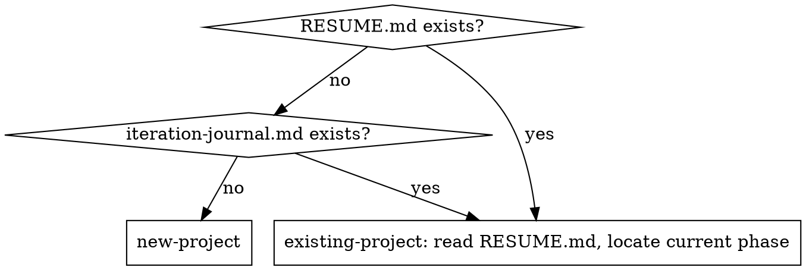

# Project Life Cycle

End-to-end coordinator for traceable, multi-phase project execution. Wraps the existing `superpowers:*` skills with the conventions surfaced during the initial pilot (see `references/origin.md`).

## This skill IS an agent harness

Borrowing Tejas Kumar's framing (["Harnesses in AI: A Deep Dive"](https://www.youtube.com/watch?v=C_GG5g38vLU), IBM, 2026): an **agent harness** is everything around the model that grounds it in reality. The model is a black box; the harness is the deterministic scaffolding that makes the model's output reliable enough to ship.

This skill is exactly that — applied to multi-phase software development. Its parts map cleanly onto the harness primitives Tejas describes:

| Harness primitive | Realized in this skill as |
|---|---|
| **Tool registry** | The set of subagents the orchestrator dispatches: researcher, story-writer, spec-writer, backend-builder, frontend-builder, acceptance-verifier, validator, code-reviewer, journal-writer (per `references/cadence.md` + `references/builder-split.md`) |
| **Guardrails** | Mandatory Conventions + Red Flags below; folder-map scoping; cadence step caps; CHANGELOG / PR label / Conventional Commits enforcement |
| **Context management** | Mandatory `/clear` between phases; handoff doc + RESUME.md as canonical session-boundary contract; cost-aware behaviors (offset+limit reads, subagent investigation, compact output flags) |
| **Agent loop** | Per-phase workflow (10 steps) + per-task cadence (6 steps); orchestrated by `/ship` for single vertical slices |
| **Verify step** | Acceptance verifier (cadence step 1.5) + Validator (cadence step 2) + dual-track smoke (`references/smoke-tracks.md`) + verify-loop pattern (`references/verify-loop.md`) — all designed so the AI doesn't self-grade |
| **Deterministic pre-step handlers** | Pattern doc at `references/deterministic-handlers.md` for project-specific auth / secret / pre-flight / safety injection |
| **Lie detection** | Validator explicitly checks builder claims against the diff + acceptance verifier report (`references/cadence.md` §step-2) |

If you're new to the skill, the practical implication of the harness framing is: **the AI alone is not enough; the harness IS the contract.** Don't ask "can the model do this" — the model can do most things. Ask "is the harness wired correctly for the model to do this safely + verifiably + repeatably."

**Native platform primitives.** Several harness concepts above are now realized by first-class Claude Code features rather than prose the model must remember — skill-frontmatter hooks (this skill ships a self-enforcing `hooks:` block: `--no-verify` / push-to-main guard + throttled close-gate nudge), `SessionStart:resume` RESUME injection, dynamic Workflows for deterministic cadence fan-out, `run_in_background` parallel reviewers, worktree-isolated builders, `AskUserQuestion` for opt-in checkpoints, and plan mode for sign-off gates. The verified map (which primitive strengthens which node + how to wire it, with verification provenance) is `references/harness-primitives.md`. Each one moves a rule from "model self-discipline" toward "platform enforcement" — the same direction Definition of Done + the close gate already point.

## User Cheatsheet (AI: surface this verbatim in chat the first time this skill is invoked per session)

**3 habits to save tokens (translate to user's preferred language when surfacing):**

1. **End of every phase → write handoff → `/clear`**
   - After finishing a phase, have AI write the handoff doc + update RESUME.md + commit, then `/clear` before starting the next phase
   - Skipping `/clear` between phases = context accumulates linearly; every subsequent turn gets more expensive

2. **Don't invoke this skill's workflow for trivial tasks**
   - Typo / single-file polish / one-off bug fix / single config tweak → just say "fix this, skip the workflow"
   - The full workflow (brainstorm → plan → 6-step cadence → handoff → PR) burns 100-300K tokens per phase
   - Use the skill for: fresh project / new milestone / multi-task feature / decisions needing research

3. **Big lookups go to a subagent, not main context**
   - "Where is X / investigate Y / list all Z / map this directory" → say "use an Explore subagent"
   - Running grep/find/Read chains in main context = context bloat that taxes every later turn
   - Subagent returns a synthesis; main context stays light

**AI MUST surface this cheatsheet to the user the first time this skill loads in any session.** Translate the cheatsheet into the user's preferred language (detect from CLAUDE.md `language` setting or recent user messages) before surfacing — the cheatsheet content is universal, but the user reads it in their own language. After surfacing once, enforce silently via the Mandatory Conventions + Red Flags below.

---

## Core Principle

Every decision, deviation, and review finding must be traceable through git + dated artifacts. Plans always drift; the drift is the most valuable signal — surface it, don't bury it.

## Definition of Done (enforced — read this BEFORE the step lists)

The #1 way this skill fails: the AI finishes the code (the interesting part), feels done, and silently skips the wrap-up — journal, tests-3×, handoff, CHANGELOG, PR-comment. Those are the LAST steps, furthest from attention once code works. Prose "MANDATORY" does not stop this. **Two forcing functions do, and both are required every time:**

1. **Materialize the steps as a TodoWrite — FIRST action on every invocation, before any work.** Emit one todo per step for the current entry: per-phase work → the 10 per-phase steps; a single cadence task → the 6 cadence steps. The wrap-up todos (journal / tests-3× / handoff / CHANGELOG / PR-comment / smoke) are **non-optional items**, never dropped from the list. Visible unchecked todos at done-time are the cheapest defense against silent skips. Mark each `in_progress`→`completed` as you go; never batch.

2. **Run the close gate — and paste its output — before claiming done.** `make task-done` after each cadence task; `make phase-done PHASE=X.Y` before opening the PR. The gate is pure code: it exits non-zero if a required artifact is missing (journal header, fresh test-evidence, handoff sections, CHANGELOG touch, smoke files, ROADMAP touch). **"It passed" without pasted gate output = unverified = not done.** Full spec, portable script, manifest, and pre-push-hook wiring in `references/close-gate.md`. **The un-bypassable layer is the active git pre-push hook** (`.githooks/pre-push` + `git config core.hooksPath .githooks`) — it physically rejects pushing an incomplete `feat/phase-*` branch regardless of whether the model remembered to run the gate. Model-run discipline alone is the weakest layer and is exactly what lets wrap-up (especially the tests) get skipped. **Before relying on the gate, confirm the hook is active:** `git config core.hooksPath` must print `.githooks`; if empty, the gate is NOT installed — run `/init-harness --refresh` to retrofit it.

**A task/phase is "done" only when every wrap-up todo is checked AND the close gate exits 0 with output shown.** A skip is legitimate only when written down as a `SKIP: <reason>` line (journal "Plan deviations") — the gate enforces this. No silent skips.

## When to Use

- A fresh repository ("let's start a new project") → branch to "new-project" entry
- An existing repository with `RESUME.md` / `iteration-journal.md` → branch to "existing-project" entry
- A milestone is about to start → invoke `superpowers:brainstorming`
- A milestone has a signed-off spec → invoke `superpowers:writing-plans`
- A phase plan is ready → run the per-task cadence below
- A milestone is closing → run the milestone-done gate

**Don't use** for one-off bug fixes, single-file polish, or trivial commits — those don't need the full machinery.

## Entry Detection

## Per-Phase Workflow

**Front door (runs FIRST, on every fresh user request — milestone kickoff AND mid-phase ad-hoc instructions like "now fix this modal"):** pass the request through the intent-gate (`references/intent-gate.md`) — **classify → confirm intent → reframe+sharpen** — before any code. Default `assume` (lay out assumptions for one-tap approve; ask one question only when a key ambiguity can't be assumed). The gate's size classification is also the **machinery triage**: trivial+clear → one-liner inline (skip the workflow); medium → per-task cadence; large → the brainstorm below. For large work the **confirmed intent seeds step 1's brainstorm — never re-asked downstream**. The gate also infers an **Archetype** (Builder default / Prototyper / Sweeper / Grower / Maintainer) — orthogonal to Size: Size picks *how much* ceremony, archetype picks *what shape* the chain takes (which cadence steps fire, default oracle, diff direction). Per-request + one-tap confirm (never frozen into a box); Sweeper's net-negative-LOC direction is the one deterministically gated delta. See `references/intent-gate.md` §"Archetype". Skip only on an already-precise prompt or a verbal "skip gate".

For each milestone:

1. **Brainstorm** → `superpowers:brainstorming` (seeded by the intent-gate front door's confirmed intent per `references/intent-gate.md` — brainstorming continues from it, never re-asks intent). Two-tier storage: append Q&A verbatim to project-wide `docs/brainstorming-qa-log.md`; produce per-phase `docs/superpowers/specs/YYYY-MM-DD-phase-N-<slug>-design.md`. **User-story file is mandatory for any user-observable phase** — produce `docs/superpowers/specs/YYYY-MM-DD-phase-N-<slug>-user-story.md` BEFORE the spec doc, per `references/user-story.md`. User signs off on the story (numbered ACs + Out-of-Scope + Open Questions) → THEN spec doc is written. Story = ground truth for the acceptance verifier (cadence step 1.5) + the validator (cadence step 2). Skip the user-story file only for pure-refactor / dep-bump / docs / internal-tooling phases with no observable behavior change. **Optional PRD** alongside spec when phase has non-engineer stakeholders (product owner / customer / non-eng reviewer needs to sign off) — see `references/prd-template.md` (PRD = product-facing user-story synthesis). Skip for infra / refactor / engineer-only phases. **CONTEXT.md / CONTEXT-MAP discovery is mandatory before Q1** — read project glossary (per `references/context-md.md`); challenge fuzzy/overloaded user-message terms against it; create CONTEXT.md lazily when first term is resolved if it doesn't exist; update glossary inline as terms get sharpened during grilling. **Language-first sub-pass** runs before implementation Qs: sharpen vocabulary first, then ask design Qs. Tag every locked decision with evidence-strength: 🟢 industry pattern (≥3 refs agree) / 🟡 mixed industry / 🔴 AI inference (highest review priority). For decisions that pass the 3-criteria gate (hard-to-reverse + surprising-without-context + real-trade-off), offer an ADR (`references/adr.md`) — ADRs survive milestones, distinct from phase-scoped locked spec decisions. **Per-question protocol is MANDATORY** — `references/brainstorm-research-protocol.md` defines the 7-step loop: frame Q → dispatch parallel research agents (advanced + novice reference tiers per CLAUDE.md) → synthesize 1st-agent recommendation with citations → blind 2nd-agent verification (sees options + research, NOT recommendation) → compare → evidence-strength tag → surface to user. **Mode choice REQUIRED at brainstorm kickoff** — ask user: Mode A (interactive, one Q at a time) or Mode B (batch, all Qs pre-researched then surfaced as a single review list in the doc). Both modes use the same 7-step protocol; they differ only in delivery cadence. **Recording is mandatory in either mode**: verbatim user message + verbatim controller framing + all research citation URLs + verbatim 1st & 2nd-agent reasoning + verbatim user decision — see protocol doc "Documenting the Q&A" section. Never opinion-poll without research; never ask the user to choose from a list of 4+ questions in one message. **HTML companion opt-in** — when brainstorm produces multi-option design exploration (mockups / dataflow / side-by-side comparison), ask user once: "Generate HTML companion for design exploration? (2-4x time, richer visuals + shareable link, MD remains source of truth)". Skip the question if `html-policy` is set in project `CLAUDE.md`. See `references/output-format.md`.
2. **Research gate** → for any decision matching the triggers in `references/research-gate.md`, do online research first; cite sources in the spec.
3. **Revision pass** → after each major decision, prompt: "Given this choice, what failure modes might we be missing? Name at least two."
4. **Plan** → `superpowers:writing-plans`. Output: `docs/superpowers/plans/YYYY-MM-DD-phase-N-<slug>.md`. **Spec finalization HTML re-opt-in** — if user declined the HTML companion at step 1 but now wants to share locked spec with stakeholders, re-ask once: "Generate HTML stakeholder view of locked spec? (renders mockups + dataflow + evidence-strength tags)". Skip if `html-policy` is set in `CLAUDE.md` or if already accepted at step 1.
5. **Branch + execute** → cut a phase-scoped branch (`feat/phase-X.Y-<slug>`, never push direct to main). Use the per-task cadence in `references/cadence.md` (6 steps: implementer → acceptance verifier [step 1.5] → validator [step 2] → code-quality review [step 3] → fixup [step 4] → journal entry [step 5]). **One task = one commit; push immediately, no batching.** **Bug encountered during execution** → invoke `references/diagnose-loop.md` (8-phase, 0–7: consult lessons → feedback loop → reproduce → falsifiable ranked hypotheses → instrument → fix + regression test → cleanup → distill); Iron Law = no fix without root cause. **Issue-tracker projects** may insert Step 4b breakdown: split the plan into vertical-slice tracer-bullet issues w/ HITL/AFK labels per `references/issue-breakdown.md`; skip if phase is owned end-to-end by single agent.
6. **Dual-track smoke** → write Track A manual checklist + Track B Playwright (or equivalent) spec. Both required for any user-visible phase. See `references/smoke-tracks.md`.
7. **Phase delivery handoff** → drop `docs/handoff/YYYY-MM-DD-phase-X.Y-handoff.md` covering 8 sections (user-facing list / daily use / file index / smoke / tests / findings / next steps + PR-body appendix). See `references/handoff-template.md`. Findings tier S1/S2/S3 per `references/findings-tier.md`.
8. **PR + Track A smoke + CHANGELOG update** → write the PR body **starting with a mandatory plain-language TL;DR at the very top, ABOVE §1** (4-6 sentences, ZERO jargon — readable by someone who does not know this part of the code; any technical term avoided OR immediately glossed in parentheses; fixed four-part shape written as FOUR BULLET POINTS — `- **Problem** —` [the symptom, not the code], `- **What we did** —` [by effect, not implementation], `- **Why we did it** —` [the motivation or trade-off that made THIS change the right one, in plain words — not implementation justification], `- **Result + honest boundary** —` [what's better now AND explicitly what we did NOT / could not do — required when the deliverable is "acknowledging a limit"]; TL;DR is for the skimmer, the §1-§3 technical sections stay unchanged below it for reviewers who dig in), then the **mandatory 3-section format**: §1 What was done (prose summary 2-4 sentences FIRST, then `### Use cases` subsection REQUIRED for new user-facing features [scenario table + comparison to existing surfaces + alternatives rejected], then file-by-file bullets), §2 Why this approach (design decisions + trade-offs + engineering alternatives rejected), §3 Requirements satisfied (✅ spec/plan items closed). Optional appendix: Test plan / Known issues / Deploy note / Refs. Full template in `references/handoff-template.md` §"PR description appendix". The 3 mandatory sections mirror the Task Close Report template — same fields. **§1 prose intro is non-negotiable** (file bullets alone don't tell reviewers what the PR does). **Use cases subsection is non-negotiable for any new CLI / slash command / endpoint / UI surface** (skip ONLY for refactors / bug fixes / pure-infra PRs). **CHANGELOG entry REQUIRED in same PR** when phase produces user-visible behavior change — add a bullet to `CHANGELOG.md` `[Unreleased]` under the right Keep-a-Changelog category (Added / Changed / Deprecated / Removed / Fixed / Security), AND apply exactly one PR label from the taxonomy (`breaking` / `feature` / `new-reference` / `new-command` / `cadence` / `workflow` / `convention` / `bug` / `fix` / `docs` / `ci` / `tooling` / `dependencies` / `chore` / `skip-release-notes`). The label drives auto-generated release notes via `.github/release.yml`. Exempt PRs (no changelog entry needed): internal-only refactors with zero user-visible delta, test-only additions, comment/formatting changes. Full discipline + per-PR rules in `references/changelog.md`. **Smoke interaction mode REQUIRED** — ask user once per phase: Mode A self-serve (give path to handoff §4 checklist, user runs alone, reports findings back) or Mode B guided (AI walks through each smoke stage step by step, user reports per-stage). Skip if `smoke-mode` is `self` or `guided` in project `CLAUDE.md`. When asking, present Mode B as the recommended option (better for catching mid-flow issues + interactive triage). CLAUDE.md `smoke-mode` default value when unset is `ask`. Then: user runs Track A → reports findings → AI fixes S1 / logs S2-S3 → merge. **Demo console output REQUIRED for console/CLI/log/REPL-surface phases** — paste the ACTUAL captured stdout of a real run into a PR comment (verbatim `cmd 2>&1 | tee`, never retyped): a `Changed → Result` two-liner + the run's money-shot visible + long dumps collapsed in `
` + a `-v` per-test behavior list (one `# what this guarantees` per test name). The demo receipt lets a reviewer see what the change produces without checking out the branch. See `references/handoff-template.md` §"Demo — real console output". Skip only for pure-infra / non-observable phases.
9. **CI gate + Copilot review (try-first-then-fallback)** → **always attempt the default path first**: push the branch, let the configured CI workflow run, then post `@copilot review` once CI is green. **Default path:** (a) CI runs all gates (type / lint / unit / integration / regression / e2e / coverage / security per `references/ci-cd-gates.md`); (b) Copilot inline review per `references/copilot-review-loop.md` — fixup commit + per-finding inline reply with SHA + Fx-label + re-trigger until clean. **Fallback path (Pattern E) is automatic when:** either the CI workflow fails to start due to "GitHub Actions payments have failed / your spending limit needs to be increased" (account-level billing block) OR Copilot's review job aborts with the same billing error. When that triggers, switch the workflow to `on: workflow_dispatch` dormant (do NOT delete it), run the R5 3× gate locally, dispatch an independent `code-reviewer` subagent as the Copilot stand-in, and **post the full R5 + stand-in evidence as a PR COMMENT** (not buried in the PR body). Full Pattern E protocol + decision flow in `references/ci-cd-gates.md` §Pattern E + `references/copilot-review-loop.md` §Copilot stand-in. Skip the loop only when (i) docs-only PR, (ii) one-line trivial fix not touching security/state/DB, (iii) user explicitly says "skip Copilot" with a reason in the PR body, (iv) Pattern E is active AND the stand-in's pass-2 findings list derives to APPROVED-CLEAN (zero open CRITICAL/IMPORTANT — computed by the controller per `references/review-record.md`, never a reviewer-stated approval).
10. **Milestone-done gate** → **run `make phase-done PHASE=X.Y` and paste its output BEFORE opening/merging the PR** — the close gate (`references/close-gate.md`) verifies user-story/spec/plan docs + a journal entry per task + handoff 8 sections + CHANGELOG `[Unreleased]` touch + Track A/B smoke artifacts (user-visible phases) + ROADMAP touch + posted test-evidence. Gate exits non-zero = phase not done. Then see `references/milestone-done.md`. **Update `docs/ROADMAP.md`** in the handoff commit: flip the finished milestone to ✅, set the next to ▶, log any scope change under "Plan changes" (per `references/roadmap.md`). The gate checks ROADMAP reflects reality before closing. **Status-file ring at close** — the read-first status doc's active section keeps the active entry + the 2 most recent closed entries only; in the same edit, the oldest closed paragraph moves **verbatim** to a dedicated archive file (never into RESUME-as-verbose-history or another living doc), newest-first, with a one-line pointer left behind. Deliberately ungated. See `references/roadmap.md` §"Close protocol — the status-file ring". **HTML summary opt-in** — at milestone close, ask user once: "Generate HTML milestone summary report? (rendered journal timeline + stakeholder-ready, 2-4x time, MD canonical artifacts unchanged)". Skip if `html-policy` is set in project `CLAUDE.md`.

## Per-Task Cadence (6 steps)

See `references/cadence.md` for full detail. Short version:

1. **Dispatch implementer subagent(s)** with the task text + ACs this task closes + scene-setting context + the story's Contingencies section verbatim (pre-declared "when X → do Y" responses — builder follows the pre-decided action instead of escalating; only undeclared surprises go BLOCKED/NEEDS_CONTEXT). **Cross-layer phases split into 1a backend-builder + 1b frontend-builder** per `references/builder-split.md` (folder-scoped tools, sequenced BE→FE, BE emits API-contract summary, FE consumes it; mismatch routes back to BE, never silently massaged client-side). Controller adds explicit "adapt to existing patterns" guidance + first-of-its-kind infra detection.
2. **Acceptance verifier (step 1.5)** — independent read-only-on-`src/` subagent writes one acceptance test per AC in `user-story.md`, exercising the system from outside (HTTP / UI / observable side-effect). Reports per-AC pass/fail/untestable. Failed AC → routes to BE or FE builder; untestable AC → spec gap surfaced to user. Skip only when `user-story.md` was skipped (pure-refactor / docs / infra).
3. **Validator (step 2)** — independent **read-only** subagent compares diff against `user-story.md` + spec + Builder Summaries + Acceptance Verifier Report. Outputs Critical/Important/Minor with file:line. Never edits, never invents issues, never does code-quality (that's step 3). Lens: correctness-vs-promise + scope drift (over-build + under-build) + folder boundary + security gaps vs spec.
4. **Code quality review (step 3)** — independent subagent — design, security, a11y, perf, **bloat-smell checklist**, forward-looking impact on downstream tasks.
5. **Fixup commit (step 4)** (separate from the original `feat(...)` commit, never amend or squash). Triage findings via `references/defer-vs-fix.md`. **Re-verification after the fixup is selective at task level** — re-run only the verifier scopes the fixup diff touched (affected ACs / affected folder-map side); `phase-done` still demands the full suite, which is the safety net. See `references/cadence.md` §"Selective re-verification after fixup".
6. **Journal entry (step 5)** (separate `docs:` commit) using the 6-section schema in `references/journal-schema.md`. **Then run `make task-done` and paste its output** — the close gate (`references/close-gate.md`) verifies the feat commit + journal "Plan deviations" header + fresh test-evidence + no orphan `[DEBUG-` logs exist. Gate exits non-zero = task not done; fix the missing artifact, do not proceed. **Human-approval timing is governed by the `close-gate` policy key** (`per-task` default | `pr-boundary`): projects that adopt a human-blocking close approval (Task Close Report awaiting the user's "ok") may move that blocking approval from every task close to once per PR/merge — an independent read-only reviewer subagent does the per-task read, reports are still written every task, the deterministic gate is unchanged, and the merge boundary MUST keep a human-written approval marker the AI cannot author. See `references/close-gate.md` §"Approval timing".

**Cadence compression** — for trivial mechanical tasks (small diff, no new logic, no security/compliance surface), skip acceptance verifier + merge validator with code-quality review into one pass. Single implementer (no BE/FE split) on layer-pure work. See `references/cadence.md`.

**Comprehension co-discovery (opt-in, phase-level)** — when `comprehension` is `lite`/`full` in `CLAUDE.md`, run one anti-cognitive-offloading round once per phase after validation (a *why*-question on the validated diff; discovery framing, non-blocking, no scoreboard, <30s). Off by default. See `references/comprehension-co-discovery.md` + `references/cadence.md` §"Comprehension Co-Discovery".

**Builder profile (opt-in, user-typed `/builder-profile`)** — reads the user's own local Claude Code transcripts (`~/.claude/projects`) and writes one markdown report to `~/.claude/builder-profile.md`: a point-in-time snapshot of how this user actually uses an AI coding agent. Purpose is self-understanding (the user sees their own patterns → can use the agent better) + shared passive context any agent can read on demand. 100% local (no network call). Gated pipeline (deterministic `stats.json` → evidence gate → self-blinded cold read → adversarial verify → independent verification: a tested `builder_profile_verify.py` hard-assertion gate + a fresh-context cold critic, so the generator doesn't grade itself); spine-first synthesis; descriptive by default (1-10 scores behind `--scores`), operating-modes-not-archetype, co-discovery-not-growth-edge, you-vs-you-not-leaderboard — same discovery-over-judgment discipline as comprehension co-discovery. The report **is** the product — no separate memory seed, no skill step wired to consume it. After it passes verification the command **walks the user through it in plain language** in-conversation (spine-first, honest about what couldn't be measured, co-discovery as real questions), not just a path drop. **Output lives at the stable read-contract path `~/.claude/builder-profile.md`** (present → passive working-style context; absent → not yet profiled) — see `references/builder-profile.md` §"Read contract". See `commands/builder-profile.md` + `references/builder-profile.md`.

## Mandatory Conventions

### Commits & branching
- **Atomic commits, push-immediate.** One task = one commit (plus optional fixup + docs:journal). Push after each commit, no batching.
- **Branch + PR for every phase.** Never push direct to main, even for doc-only changes. Branch name: `feat/phase-X.Y-<slug>`.
- **Fixup commits are independent commits.** Never amend a published commit; never squash review history away.
- **Pre-commit / formatter / linter must run locally before commit.** CI catching formatting drift means a wasted push cycle. Never use `--no-verify`; fix the hook complaint instead.
- **PR description MUST use 3-section format** — §1 What was done (prose intro FIRST, then `### Use cases` subsection for new user-facing features, then file bullets) / §2 Why this approach / §3 Requirements satisfied. Mirrors Task Close Report template. Full template + rationale in `references/handoff-template.md` §"PR description appendix".
- **Commit message + PR description in English.** Chat / project Q&A can be in the user's preferred language; durable artifacts default to English so they're greppable across projects and reviewers.

### Versioning, CHANGELOG, and release notes
- **`CHANGELOG.md` at repo root, Keep a Changelog 1.1.0 format.** Newest version at top; `[Unreleased]` section accumulates between tags; six categories (Added / Changed / Deprecated / Removed / Fixed / Security); ISO 8601 dates. Full discipline + anti-patterns in `references/changelog.md`.
- **Every PR with user-visible behavior change MUST update `[Unreleased]` in the same PR.** Reviewers reject otherwise. Internal refactors with zero user-visible delta are exempt (apply `chore-quiet` / `skip-release-notes` labels).
- **Every PR carries exactly one category label** from the taxonomy in `references/changelog.md` §"PR label taxonomy". Label drives auto-generated GitHub release notes via `.github/release.yml`. Uncategorized PRs land in "Other Changes" catch-all → fix before cutting a release.
- **PR title in Conventional Commits style** (`feat:` / `fix:` / `feat!:` for breaking / `docs:` / etc.). This is what auto-release-notes displays.
- **SemVer bump per release**: MAJOR if any `breaking` PR in unreleased set; MINOR if any `feature` / `new-reference` / `new-command`; PATCH if only `fix` / `docs` / `chore`. Bump both `.claude-plugin/marketplace.json` and `.claude-plugin/plugin.json` together; CI validator rejects mismatch.
- **Release flow is automated via `/release`** (slash command shipped in `commands/release.md`). Run `/release` (or `/release minor` / `patch` / `major` to override the auto-inferred bump) → orchestrator validates preconditions → computes bump from `[Unreleased]` content → asks human to confirm version once → renames CHANGELOG section + bumps both manifests + commits + tags + pushes + watches the workflow + verifies the GitHub Release landed. Do NOT edit `CHANGELOG.md` / `.claude-plugin/*` / git tags by hand for releases — the discipline is exactly that `/release` is the single entry point. Manual fallback flow + retroactive-tag recovery in `references/release-process.md`.

### Documentation & traceability
- **`docs/ROADMAP.md` is the whole-plan map** — the single doc answering "what is the entire plan + where am I in it?" Created at kickoff (by `/init-harness` or end of first brainstorm once milestones are known), updated at every milestone boundary **in the same commit as the handoff + RESUME** (flip finished milestone to ✅, next to ▶). Distinct from RESUME (current-phase, churns + gets `/clear`-truncated) — ROADMAP is stable, milestone-granularity, and survives long projects so neither human nor AI loses the shape of the whole thing by milestone 9. Scope changes are amended in the table AND logged under a dated "Plan changes" section (drift is signal). Full structure + status legend (✅ done / ▶ current / ☐ planned / ⏸ paused / ✗ dropped) in `references/roadmap.md`.
- **Journal "Plan deviations" header is required** even when the body is "none" — its presence forces an active drift check.
- **Evidence-strength tags on locked design decisions** — 🟢 industry pattern (≥3 refs agree) / 🟡 mixed industry / 🔴 AI inference. 🔴 is highest review priority.
- **Mid-phase resume note** — when a phase spans multiple sessions or `/clear` events, drop a `docs/research/YYYY-MM-DD-mX.Y-resume-note.md` capturing what's done, what's next, and the contracts the next session must honor.
- **Backlog discipline** — any deferred decision lands in a backlog file with explicit Trigger + Exit criteria.
- **TOC index on long-lived docs** — any append-only file (brainstorming-qa-log, iteration-journal, RESUME, smoke-findings, mid-phase-questions) or any doc >300 lines carries a top-of-file index with anchor links to each section. Both H2 sections and H3 sub-questions are linked. The index is updated **in the same commit** as the section append — never leave the index stale. Full convention + maintenance rules in `references/document-indexing.md`.

### Parallel work & multi-session discipline
- **WIP=1: one active code track per project.** Anything running the per-task cadence (and ending in commits) is a code track. The gate chain serializes on the human — parallel code tracks multiply gate load + merge risk without adding speed. See `references/parallel-work.md`.
- **Sidecar exception** — doc-only research/investigation may run parallel to the active code track: no gate chain, zero code changes, writes only research docs (e.g. `docs/research/`), never the status/roadmap file. A sidecar that wants to touch code or the status file is a second code track — stop it.
- **Single-writer rule** — when multiple sessions share a worktree, exactly one session holds the pen for the status/roadmap file (STATUS/ROADMAP/RESUME). Sidecar findings enter through the pen-holding session; pen handover is explicit, never assumed.

### Reviews
- **Three review categories** — spec compliance, code quality, **forward-looking** (works now but downstream task will be hurt). All three are valid reviewer outputs.
- **The writer never reviews its own work — and never edits its reviewer's words.** Reviews come from fresh-context, read-only subagents under the dispatch constraints in `references/review-record.md` (explicit tier ≥ implementer's, refute-first with verdict-field LAST, `file:line` evidence gate, controller-computed verdict — never a reviewer-stated "approved"). The review goes on the PR as a **bidirectional record**: reviewer report verbatim (writer must not condense it) + builder per-finding response (agree/disagree + why, re-graded severity, what changed / deliberately didn't).
- **Between finding and fix**: mechanically verifiable findings → fix (one review-fix = one commit); judgment calls → "Reviewer asks" for the human; reviewer-suggested fix code is **untrusted input** (adopt the finding, re-derive the fix, add a test); review-fixes are unreviewed code → final-pass reviewer before close. Coverage window: commits after the last review SHA are unreviewed. See `references/review-record.md`.
- **`@copilot review` is mandatory on every non-trivial PR.** Triggered after CI goes green. Every inline finding must receive an in-thread reply with the fix SHA + Fx-row label (or a deferred-with-reason reply). Re-trigger `@copilot review` after the fixup commit lands; loop until Copilot returns "no actionable issues" or user signs off on remaining items. Stacked PRs follow the same loop on the head-vs-base diff. Full protocol + `gh api` command reference in `references/copilot-review-loop.md`.
- **Blind 2nd-agent revision on locked design decisions** — every major locked decision passes an independent reviewer who does NOT see which option was chosen, to catch self-confirmation bias. Full protocol in `references/brainstorm-research-protocol.md` §step-4 (fresh agent / options + research only / no recommendation visibility / side-by-side compare / disagreement is surfaced to user, never silently overridden).
- **Research-first per brainstorm question** — never present options to the user without dispatching research first. Tier 1 advanced + Tier 2 novice (project-specific lists live in `CLAUDE.md`) must both be surveyed for UX questions; single-tier is allowed for BE-only / data-shape questions but ≥2 reference products / sources is the floor. See `references/brainstorm-research-protocol.md` for the dispatch template and banned patterns.

### Smoke & delivery
- **Dual-track smoke is required for user-visible phases** — Track A manual + Track B Playwright (or equivalent). See `references/smoke-tracks.md`.
- **Phase delivery handoff doc is required** before opening the PR. See `references/handoff-template.md`. The doc body lands in the PR description.
- **Findings tier S1/S2/S3** — see `references/findings-tier.md`. S1 blocks merge; S2 ships with follow-up issue; S3 captured for later phase.
- **One-shot test runner** — every project should have a `make phase-checks PHASE=X.Y` (or equivalent) target. Output feeds the handoff doc.
- **PR comment 9-layer audit narrative is MANDATORY on every non-trivial PR** — separate from PR body (3-section template) and separate from raw test evidence (folded `
`). The 9 layers (golden-path demo / negative-path demo / before-after / cost transparency / performance vs targets / findings tier / close-gate output / reviewer asks / what's next) give reviewers + future-auditors the **why-this-matters narrative** the diff alone can't carry. Draft both PR body + PR comment as `.md` files in `docs/pr-drafts/` BEFORE invoking `gh pr create` / `gh pr comment` (user previews + audit trail). UI / SSR / dashboard phases require a dedicated `tests/e2e/<phase>-screenshots.spec.ts` capturing 3-5 full-page PNGs into `docs/pr-drafts/screenshots/` (numbered by user flow, committed for audit, embedded via GitHub raw URLs in Layer 1/2). Full template + per-layer rules + visual-capture pattern + draft-first workflow + N/A skip protocol in `references/pr-comment-template.md`. Raw test evidence (`tsc` / unit×3 / integration×3 / regression×3) is the companion folded layer at the bottom, per `references/ci-cd-gates.md` §"Posting test evidence".

### Output format & smoke interaction
- **MD is canonical for audit / AI-consumed / diff-critical artifacts** — qa-log, iteration-journal, RESUME, mid-phase resume note, plan, handoff body, PR description, backlog. Never replace with HTML. HTML diffs are noisy and break traceability; subagents read these N times so token cost compounds.
- **HTML companion (opt-in) at 2 nodes only**: (a) spec/design doc — asked at brainstorm exploration (step 1) and re-askable at spec finalization (step 4) if user deferred earlier, (b) milestone-done summary report (step 9). Same `design.html` file may be regenerated at finalization. MD stays source of truth; HTML is a generated view co-committed alongside.
- **Project-level overrides via `CLAUDE.md`** — `html-policy: ask | always-md | always-html` (default: `ask`), `smoke-mode: ask | self | guided` (default: `ask`, recommended `guided`), `comprehension: off | lite | full` (default: `off` — anti-cognitive-offloading co-discovery round, see `references/comprehension-co-discovery.md`), `close-gate: per-task | pr-boundary` (default: `per-task` — where the human-blocking close approval sits, see `references/close-gate.md` §"Approval timing"), and `archetype: auto | <name> | off` (default: `auto` — intent-gate infers the work's archetype per request to reshape the chain Size routed into, see `references/intent-gate.md` §"Archetype"). When set, skill skips the opt-in question for that node. See `references/output-format.md`.
- **PR description is markdown-only** — GitHub PR body does not render HTML. Any "richer" PR companion ships as an HTML artifact uploaded to S3 (or similar) with a link in the PR body, not inline HTML.

### CI / CD discipline
- **Three layers** — local pre-commit (every commit) + PR-time CI (full test/lint/type/coverage/schema-drift/handoff-doc-check) + merge protection on `main`. See `references/ci-cd-gates.md` for the gate list, decision tree, and example configs.
- **Never `--no-verify`** on commit or push. Fix the hook complaint instead.
- **CI must include**: format, lint, type check, **unit + integration + regression tests** (regression = Track B e2e / Playwright catching breakage in existing behavior, not just new-feature coverage), coverage floor, schema drift check, migration round-trip (if applicable), handoff-doc presence check on phase commits, security scan.
- **Branch protection** on `main` requires CI green, no force-push, no direct push. PR is the only path.
- **Try-CI-first, fallback only on confirmed billing block** — default path: push, let CI run, post `@copilot review` once CI is green. Switch to Pattern E (workflow dormant + local R5 + `code-reviewer` stand-in subagent) ONLY when CI or Copilot actually fails with the account-level "GitHub Actions payments have failed / spending limit needs to be increased" error. Never pre-emptively skip CI because it was blocked in a prior phase — re-verify each phase. Full decision tree + Pattern E mechanics in `references/ci-cd-gates.md` §Pattern E.
- **All test results land in a GitHub PR COMMENT** (not just buried in the PR body) — both paths (default CI + Pattern E). Body = narrative summary; comment = audit artifact (timestamped, attributable, re-postable per fixup). Required PR-comment fields, same shape both paths: raw type-check + 3× unit + 3× integration + 3× regression/e2e output blocks; Track A smoke summary table (if user-visible phase); S1/S2/S3 findings tally with Trigger/Exit for any deferred S3; Copilot or stand-in review status with SHAs; merge-readiness statement. Default path additionally links to the CI run page; Pattern E pastes local output verbatim. See `references/ci-cd-gates.md` §"Posting test evidence" for the exact format.
- **Full gate includes the regression/e2e layer even on BE-only phases** — gate proves the whole project still works after this phase's diff, not just the tests touching this phase's code. Skipping the e2e 3× because "I didn't touch UI" is exactly the silent regression the gate catches.

### Self-update (when the user asks to evolve THIS skill)
- **The repo is the single source of truth.** The skill is consumed as a versioned plugin (installed from the marketplace into the plugin cache); released changes reach sessions only via version bump + release + plugin update.
- Default flow when user says "update the workflow / add this rule": edit the repo on a feature branch → `validate.py` → PR per CONTRIBUTING.md → done. No version bump, no tag, no release.
- Try unreleased changes via `claude --plugin-dir <repo-path>` — the working tree shadows the installed version for that session. Per-session flag; confirm what's loaded via `/plugins` first. SKILL/reference text is live immediately; `hooks/` + `commands/` need `/reload-plugins`.
- Release flow (explicit only, when user says "release vX.Y.Z" or equivalent intent to ship): run `/release` — bumps both `.claude-plugin/{marketplace,plugin}.json`, commits, tags, pushes. `release.yml` creates the GitHub Release.
- Scope check first: cross-project rules go in this skill; stack / domain / business / audience rules go in the project's `CLAUDE.md`. Default to project's CLAUDE.md when ambiguous; promote to skill only after ≥2 projects use the rule or the user explicitly says "make it universal."
- Never cut a skill RELEASE mid-phase if it changes the current phase's exit criteria (merging to main is fine — sessions keep their released version until they update).
- See `references/self-update-flow.md` for the full decision tree and anti-patterns.

### Cost-aware behaviors
- **Read with offset + limit by default** for files > 200 lines; grep / Explore before Read; never re-read the same file in a session.
- **Compact output flags by default** — `pytest -q`, `vitest --reporter=line`, pipe verbose commands through `tail` / `head`.
- **One-sentence updates between tool calls** — no preamble, no closing pleasantries, no re-summarizing diffs.
- **MANDATORY `/clear` between phases** — at every phase boundary, write handoff doc + update RESUME.md + commit, then `/clear` before starting next phase. Long-running sessions (>1 phase) accumulate context linearly and slow every subsequent turn.
- **Skill scope triage BEFORE invoking project-lifecycle** — invoke ONLY for: fresh project setup, new milestone, multi-task feature, decisions needing research. Do NOT invoke for: one-off bug fix, single-file polish, trivial commit, docs typo, single config tweak. For those, do the work inline (no brainstorm, no plan, no cadence). The full workflow costs 100-300K tokens per phase; trivial work doesn't earn it.
- **Cadence compression for mechanical tasks** — when task is small diff + no new logic + no security/compliance surface, merge spec + code review into one pass (saves ~15-30K tokens per task). See `references/cadence.md`.
- **Brainstorm Mode B (batch) when ≥3 questions** — Mode A dispatches research subagents per Q. Mode B shares dispatch overhead across all Qs. Saves 50-100K tokens on multi-Q brainstorm phases.
- **Investigation work goes to subagent, not main context** — for "where is X / how does Y work / list all Z" lookups, dispatch `Explore` or `general-purpose` subagent and consume its synthesis. Don't run grep/find/Read chains in main context.
- **Model selection per subagent** — Haiku 4.5 for high-frequency lightweight subagents (implementer for trivial tasks, brainstorm research Tier 2, journal entry generator). Sonnet 4.6 for general coding (implementer for typical tasks, spec/code reviewer). Opus 4.7 reserved for architectural decisions and the orchestrator/controller context.
- Full discipline + tool-adopt list (RTK / token-savior / context-mode / code-review-graph) in `references/cost-aware-behaviors.md`.

## Quick Reference

| Situation | Action |
|---|---|
| **Fresh user request arrives (milestone OR mid-phase ad-hoc)** | Run the intent-gate front door (`references/intent-gate.md`): classify → confirm intent (assume + one-tap approve) → reframe+sharpen into a precise prompt w/ a named oracle (specified>differential/golden>metamorphic>implicit). Size triage: trivial→one-liner inline / medium→cadence / large→seed brainstorm (no re-ask) |
| Deciding what *kind* of work this is (new spike / production build / delete-simplify / PMF tune / mature-system upkeep) | Intent-gate infers the **Archetype** (Builder default / Prototyper / Sweeper / Grower / Maintainer) + one-tap confirm; it reshapes the chain Size routed into (which cadence steps fire, default oracle, diff direction). Sweeper's net-negative-LOC diff direction is the one deterministically enforced delta (`references/close-gate.md` §"Sweeper diff-direction"). Per-request, never frozen. `references/intent-gate.md` §"Archetype" |
| New decision, non-trivial | Research first; cite in spec; do revision pass |
| Request is fuzzy / "this is wrong, fix it" / can't articulate precisely | The intent-gate's job — Stage 2 step-back (bug/missing-capability/design-choice/scope-undefined) + restate + assume; Stage 3 emits root-cause hypothesis + wrong-if + named oracle. `references/intent-gate.md` |
| Small mechanical task | Compress cadence (merge reviewers) |
| Plan snippet conflicts with existing code | Tell implementer to adapt; document in journal "Plan deviations" |
| First task touching a new tooling category | Insert bootstrap step or augment implementer prompt |
| Reviewer finds Important issue | Apply defer-vs-fix triage |
| Fixup landed, deciding what to re-verify | Task level: selective — only scopes the fixup diff touched (affected ACs / folder-map side). Phase level: always full suite (`phase-done` unchanged). See `references/cadence.md` §"Selective re-verification after fixup" |
| Foreseeable failure path spotted during story/spec | Add a `when <observable> → <action>` line to the story's Contingencies section; cadence step 1 injects it into the builder prompt verbatim |
| Codegen artifact change | Regen lands in same commit as source change |
| Research/investigation wanted while a code track is mid-flight | Run it as a sidecar: doc-only, no gate chain, writes only `docs/research/`, never the status/roadmap file (per `references/parallel-work.md`) |
| Two sessions share one worktree | Single-writer rule: one session holds the pen for the status/roadmap file; the other hands findings over for integration (per `references/parallel-work.md`) |
| Milestone closing | Run milestone-done gate + update `docs/ROADMAP.md` (✅/▶ flip, log scope changes) per `references/roadmap.md` |
| Lost the shape of the whole project / "what's the plan again?" | Read / update `docs/ROADMAP.md` — the whole-plan map (one-sentence goal + milestone table + status). Create it if missing (per `references/roadmap.md`) |
| Bug appears mid-phase | Invoke `references/diagnose-loop.md` — consult `docs/lessons.md` first (Phase 0), then build feedback loop, then ranked hypotheses, then fix. Iron Law applies. Verified root cause passing the distill gate (general + verified + non-obvious) → distill into `docs/lessons.md` (Phase 7) |
| User-message term is fuzzy / overloaded / missing from CONTEXT.md | Sharpen language first (per `references/context-md.md`), update glossary inline, then proceed |
| Hard-to-reverse decision locked w/ surprising rationale | Offer ADR (per `references/adr.md`) — 3-criteria gate, lazy creation |
| User-facing phase w/ non-eng stakeholders | Produce PRD alongside spec doc (per `references/prd-template.md`); skip for engineer-only phases |
| Issue-tracker project + multi-contributor phase | Insert Step 4b breakdown into vertical-slice tracer-bullet issues (per `references/issue-breakdown.md`) |
| User-observable phase (new endpoint / UI / CLI flag / user-triggered job) | Write `user-story.md` w/ numbered ACs BEFORE spec; user signs off; ACs flow downstream to acceptance verifier + validator (per `references/user-story.md`) |
| Phase spans backend + frontend | Split implementer into BE-builder + FE-builder with folder-scoped tools; BE first, emits API-contract summary, FE consumes (per `references/builder-split.md`) |
| Want single-prompt orchestration of a vertical slice | Use `/ship <feature>` command (chains researcher → story → spec → BE → FE → acceptance verifier → validator → fix loop → PR w/ 3 human checkpoints) |
| PR ready, change is user-visible | Add a one-line bullet to `CHANGELOG.md` `[Unreleased]` under Added/Changed/Fixed/etc. AND apply one PR category label per `references/changelog.md` |
| About to `gh pr create` / `gh pr comment` | STOP — first draft body + comment as `.md` files in `docs/pr-drafts/<date>-phase-<X.Y>-{pr-body,pr-comment}.md`. PR comment uses the 9-layer audit narrative (Demo golden / Demo negative / Before-After / Cost / Performance / Findings tier / close-gate output / Reviewer asks / What's next) + folded raw evidence. UI / SSR phases also commit a dedicated `tests/e2e/<phase>-screenshots.spec.ts` + 3-5 PNGs to `docs/pr-drafts/screenshots/`. Then `gh pr create --body-file ... && gh pr comment <PR#> --body-file ...`. Full template + per-layer rules + N/A skip protocol in `references/pr-comment-template.md` |
| Time to cut a release | Run `/release` (optional `major` / `minor` / `patch`; default `auto` infers from `[Unreleased]` content). Automates: rename `[Unreleased]` → `[X.Y.Z]`, bump both manifests, commit, tag, push, verify GitHub Release. One human checkpoint (confirm version). Full spec: `references/release-process.md` |
| Fresh project / existing project adopting this skill for the first time | Run `/init-harness`. Detects stack + folder layout + tooling → generates CLAUDE.md / folder-map / policy keys / project-shared `.claude/commands/` / deterministic handler scaffolds / CHANGELOG seed. Idempotent (merges into existing files; never overwrites without explicit confirm). 4 human checkpoints. Full spec in `references/init-harness.md`. After bootstrap → `/ship` your first feature |
| New person (or AI agent) joining this project | Day 1 = codebase Q&A ONLY (no edits / no PRs). Read CLAUDE.md / CONTEXT.md / RESUME.md / iteration-journal + ls `docs/superpowers/` + `.claude/commands/`. Day 2+ = small `/ship`. Full protocol in `references/onboarding.md` |
| Subagent needs to check its own work (test / screenshot / curl) | Wire a verify loop into the dispatch per `references/verify-loop.md`. Three canonical loops: test (Loop A), visual (Loop B), runtime (Loop C). Cap iterations; on BLOCKED, surface to controller. Without a verify step, the LLM self-grades and lies |
| Failure mode has one right answer (auth / secrets / lint / migration safety / tenant isolation) | Write a deterministic handler per `references/deterministic-handlers.md`. Pure code, runs every loop iteration before LLM, exits early when N/A, injects `[HARNESS]` message when it acts. NEVER let the LLM "figure out" auth or secrets |
| Request qualifies for unattended execution (machine-checkable oracle + scope fence + no irreversible ops + no design judgment) | Intent-gate AFK axis OFFERS a loop contract per `references/afk-loop.md` (4 fields: Goal / Stop / Budget / Report) — never auto-starts. Loop terminus = pushed `loop/` branch + exit report; PR ceremony runs in the next interactive session; **merge is human-only** |
| AFK run ended (any of the 7 end states) | Next interactive session auto-surfaces the exit report; COMPLETE → re-run the goal check once before believing it (failure → COMPLETE_UNCONFIRMED); compile `iterations.log` into the PR-comment "AFK Run Narrative" layer. See `references/afk-loop.md` §Exit report |
| AI keeps using wrong tool / wrong convention | Type `#` + the rule → auto-appends to CLAUDE.md. Over weeks, CLAUDE.md becomes a record of every surprising assumption. See `references/ergonomics.md` for the full ergonomics list |

## Red Flags — STOP

- **User request taken straight into code or brainstorm without passing the intent-gate front door** → stop; run `references/intent-gate.md` first (classify → confirm intent → reframe+sharpen). Fuzzy-in → drift-out, and self-graded "MATCHES" against the AI's own memory, are the failures this front door exists to prevent. Skip only on an already-precise prompt or a verbal "skip gate".
- **Brainstorming re-asks intent the intent-gate already confirmed** → the gate's confirmed intent is the brainstorm SEED; continue from it, don't restart. Re-interrogating wastes the user's time. Gate = first 10s of a big job; brainstorm continues its output.
- **Reframe surfaced without a named oracle** (just "diff against the spec") → name WHICH oracle type from the ladder (specified>differential/golden>metamorphic>implicit) and pick the strongest available; if none, take the no-oracle branch (manufacture golden / flag low-confidence / reclassify as missing-Phase). A fabricated confident-but-wrong oracle or root cause is worse than admitting there is none. See `references/intent-gate.md`.
- **Skill invoked without materializing the step list as a TodoWrite first** → stop; emit the todos (per-phase or per-task) before any work. No visible tracker = wrap-up steps silently dropped. See "Definition of Done".
- **Task/phase claimed "done" without running the close gate and pasting its output** → not done. Run `make task-done` (per cadence task) / `make phase-done PHASE=X.Y` (per phase); paste output. "It passed" without shown output = unverified. See `references/close-gate.md`.
- **Tests slip through the hooked gates** (`.claude/.last-test-run` never written even though commits/pushes happen) → the gate that the pre-push hook runs is `phase-done`, and `phase-done` MUST check fresh test-evidence. If it doesn't, a phase ships with tests never run — tests are the one wrap-up artifact most likely to have no live gate, because `task-done` (which checks evidence) has no hook and `phase-done` historically omitted the check. Confirm `phase-done` lists a `fresh test-evidence` line in its output; if absent, the gate script is out of date — re-sync from `references/close-gate.md`. See `references/close-gate.md` §"What the gate checks".
- **Gate scripts present but the pre-push hook is not active** (`git config core.hooksPath` is empty AND no per-tool pre-push stage) → the un-bypassable layer is absent; only model-discipline remains. Confirm `git config core.hooksPath` → `.githooks` (or husky/lefthook wired). Retrofit with `/init-harness --refresh`, then `make test-gate PHASE=X.Y` to confirm every check flips. See `references/close-gate.md` §Wiring.
- **A wrap-up step (journal / tests-3× / handoff / CHANGELOG / smoke / PR-comment) skipped without a logged `SKIP: <reason>`** → blocked; either do it or write the one-line reason in the journal "Plan deviations" section. Silent skips are the failure this skill exists to prevent.
- **A sidecar session edits code or the status/roadmap file** → not a sidecar anymore; it's a second code track violating WIP=1 + the single-writer rule. Stop it; route the change through the active track / the pen-holding session. See `references/parallel-work.md`.
- Plan author skips brainstorming because "the spec is obvious" → don't.
- **Brainstorm question presented to user without dispatched research first** → stop, demote any "answered" Qs to tentative, re-run the 7-step protocol per `references/brainstorm-research-protocol.md`.
- **Brainstorm question asked of user when codebase exploration could answer it** → stop, dispatch `Explore` subagent first. If exploration resolves the Q, drop it from the user-facing list (log finding in spec). If exploration narrows the Q, present grounded options not open-ended. Asking the user what `grep` can answer wastes their time.
- **Multiple brainstorm questions asked in one message** → stop, ask only the next one.
- **Blind 2nd-agent step skipped because "the answer is obvious"** → obvious answers are where confirmation bias hides; run the step, it's cheap.
- **1st & 2nd agent disagreed but controller silently picked one** → blocked; surface the disagreement to the user, let them break the tie.
- **Recommendation without citations** → "opinion alone is not enough"; must cite ≥1 reference product or industry source.
- **Brainstorm kickoff without asking mode (A interactive vs B batch)** → ask first; default-guessing wastes user time.
- **Q&A entry omits verbatim user message or verbatim agent reasoning** → log loses audit value; recording is non-negotiable in either mode.
- **Long-lived doc appended without updating the TOC index** → index drifts; readers can't find new sections. Update index in the same commit as the append.
- Implementer copies plan code verbatim without checking for codebase conventions → controller failed; re-dispatch.
- Reviewer says "approved" with open Important findings → apply defer-vs-fix; don't approve until triaged.
- Journal entry omits "Plan deviations" → blocked; cannot close task.
- `feat(...)` commit amended after review → blocked; create a fixup commit instead.
- Pre-commit ran only at PR time → fix locally before next commit.
- PR opened without a handoff doc → blocked; write the handoff first, then open PR with its body.
- **Workflow file deleted when CI is billing-paused** → revert. Pattern E (`workflow_dispatch` dormant) is canonical. Spec stays at the conventional location; restoration = 4-line `on:` edit. See `references/ci-cd-gates.md` §Pattern E.
- **Pretending an Actions-billing-blocked PR can merge without review** because Copilot 2nd-pass is silently failing → dispatch an independent `code-reviewer` subagent as the 2nd-pass stand-in. Treat its findings the same as Copilot's. See `references/copilot-review-loop.md` §Copilot stand-in.
- **PR merged without `@copilot review` loop closing** on a non-trivial phase → blocked; trigger the loop, fix-and-reply per finding, re-trigger until clean. The loop is mandatory; skip only when (docs-only) / (1-line trivial) / (user explicitly opts out with reason in PR body). See `references/copilot-review-loop.md`.
- **Copilot finding marked "fixed" without an in-thread reply pointing at the SHA + Fx label** → next Copilot review will re-flag it; reviewer can't tell what changed. Reply per-finding inline, never via a top-level summary comment.
- **Test evidence only in PR body, not as a PR comment** → blocked; post via `gh pr comment <PR#>` with raw `tsc` + 3× unit + 3× integration + 3× regression/e2e output blocks + Track A summary + findings tally + Copilot/stand-in status. Applies to BOTH paths (default CI + Pattern E). Body summary OK; audit artifact lives in the thread. See `references/ci-cd-gates.md` §"Posting test evidence".
- **PR comment posted as raw test logs only, without the 9-layer audit narrative** → blocked; the raw evidence is the FOLDED layer at the bottom, not the whole comment. Wrap it with: Layer 1 golden-path demo (real stdout per surface, NOT mock fixture), Layer 2 negative-path demo (errors are features), Layer 3 before/after value table, Layer 4 cost transparency (skip if no paid API), Layer 5 performance vs go/no-go targets, Layer 6 findings tier S1/S2/S3, Layer 7 close-gate output paste, Layer 8 reviewer asks (specific file:line questions, 3-5 max), Layer 9 what's next (LOCKED follow-ups only). Skips allowed only when written `(N/A — <reason>)`. See `references/pr-comment-template.md`.
- **`gh pr create` / `gh pr comment` invoked without first writing `docs/pr-drafts/<date>-phase-<X.Y>-{pr-body,pr-comment}.md`** → reviewer can't preview, audit trail lost. Draft-first. Edit later via `gh pr comment --edit-last --body-file <updated draft>` so the disk + live thread stay in sync.
- **UI / SSR / dashboard phase merged without a dedicated `tests/e2e/<phase>-screenshots.spec.ts` + 3-5 PNGs committed under `docs/pr-drafts/screenshots/`** → reviewer sees code but no visual proof of what changed. `screenshot: 'only-on-failure'` config does NOT count — the spec must call `page.screenshot({path, fullPage: true})` per scenario and run on every green build. Embed via GitHub raw URLs in PR comment Layer 1/2.
- **e2e/regression 3× skipped on BE-only phase** → not done. The gate proves the whole project still works after this phase's diff. Existing UI tests can regress on a BE-only change (e.g. response-shape, error code, schema field). Run `bun run e2e` (or equivalent) 3× even when no UI was touched.
- **Pre-emptively switching to Pattern E without verifying CI is blocked for THIS PR** → not done. Try the default path first (push, watch CI, trigger Copilot). Switch to Pattern E only when CI or Copilot actually fails with the account-level billing error. Billing state can change between phases.
- Phase claims "done" without dual-track smoke artifacts → not done; ship checklist + e2e first.
- **Console/CLI/log-surface phase merged without the real run output pasted on the PR** → reviewer can't see what the change actually produces; capture verbatim (`cmd 2>&1 | tee`) and post it as a PR comment with a `Changed → Result` framing + a `-v` per-test behavior list. Retyped/summarized output ("13 passed") does NOT count. See `references/handoff-template.md` §"Demo — real console output".
- Handoff §1 reads like a changelog full of jargon → rewrite for product-owner audience (daily language, "I can now..." voice).
- **Force-MD artifact rendered as HTML** (qa-log / journal / RESUME / plan / handoff body / PR description / backlog) → blocked; revert to MD. Audit/diff/token reasons are non-negotiable. See `references/output-format.md`.
- **Smoke kickoff without asking interaction mode** (when `smoke-mode` is `ask` in CLAUDE.md or unset) → ask first; default-guessing wastes user time.
- **HTML companion generated without user opt-in** at non-policy projects → revert; the time/token cost is the user's choice, not AI's.
- **HTML companion generated without following the section pattern in `references/html-companion-template.md`** → revert; the structural template + skeleton enforce mandatory sections (customer voice / stakeholder lens / side-by-side / mockup / state machine / disagreements / glossary / inline citations) and a shared CSS palette so every project's HTML companion looks consistent and stays readable for zero-domain-knowledge audiences. Free-form HTML loses that consistency.
- **PR opened without a `CHANGELOG.md` `[Unreleased]` entry** on a user-visible change → blocked; add the line under the right Keep-a-Changelog category before merge. Internal-refactor PRs with zero user-visible delta exempt (apply `chore-quiet` / `skip-release-notes` label). Full rules in `references/changelog.md`.
- **PR opened without exactly one category label** from the taxonomy → blocked. Label drives release-notes grouping; without it, the PR lands in "Other Changes" catch-all and the next release notes ship messy.
- **Release cut without renaming `[Unreleased]` → `[X.Y.Z] — YYYY-MM-DD`** first → next contributor adds entries under the wrong section; rebase to fix or accept drift in the following release.
- **Version bumped in only one manifest** (`marketplace.json` ≠ `plugin.json`) → CI validator catches; never bypass.
- **Cutting a release by hand** (editing CHANGELOG / manifests / tagging manually) when `/release` is available → defeats the single-entry-point discipline; consistency drifts; next `/release` may misparse. Use `/release` and trust the validator.
- **CHANGELOG bullet written in commit-message tone** ("refactor X for clarity") → rewrite in user-facing tone. Audience is upgraders, not git archaeologists; bullet must be greppable + name the artifact (file / endpoint / command / convention).
- **Deprecation skipped** (feature removed without prior `Deprecated` entry in an earlier release) → users discover via breakage. Always announce in `Deprecated` first; remove in a later MAJOR.
- **HTML companion fails any one of the 4 anti-AI-slop hard rules** (per `references/html-companion-template.md` §Quality floor): (1) Latin-first font stack on CJK project, (2) non-8 px spacing values, (3) muted text under WCAG AA contrast, (4) fabricated example data ("Acme Corp" / "user@example.com" / lorem ipsum) → not shippable; regenerate with rule enforced in prompt, or hand-edit the failing section before publish. AI-default HTML drifts into low-contrast / generic-stock / made-up-data territory; the 4 rules are the bar that separates "designed" from "AI-slop".
- **Starting new phase without `/clear` + handoff + RESUME from previous phase** → context accumulates linearly; cost-per-turn grows. Write artifacts, commit, `/clear`, then start.
- **Invoking project-lifecycle for trivial work** (typo fix / single-file polish / one-off bug / docs tweak) → skip the workflow entirely; do it inline. Skill scope triage is in the cost-aware bullets.
- **Running multi-file investigation in main context** (grep + find + Read chains) when an `Explore` subagent would do it and return a synthesis → dispatch the subagent; main context bloat hurts every subsequent turn.
- **Full 6-step cadence on mechanical task** (small diff / no new logic / no security surface) → compress to spec+code merged review. See `references/cadence.md`.
- **TDD writing all tests first then all impl (horizontal slicing)** → stop. Horizontal slicing produces "crap tests" — they test the imagined shape, not real behavior, and pass when behavior breaks. Switch to vertical tracer-bullet: 1 test → minimal impl → next test → minimal impl. Each test responds to what the previous cycle taught you. Refactor only when GREEN, never while RED.
- **Implementer asked to write tests for "everything"** → stop. You can't test everything. Controller must confirm with user which behaviors matter most BEFORE the implementer writes tests. Critical paths + complex logic, not exhaustive edge-case enumeration.
- **Implementer started writing code without emitting the pre-flight assumption block** → blocked; revert / re-dispatch. Pre-flight is mandatory (assumptions + alternative interpretations + simpler-approach-considered) BEFORE first line of code. Wrong-assumption-then-run is the #1 LLM coding failure mode; surface-before-code is the counter. See `references/cadence.md` §Step 1.
- **Implementer touched files / lines orthogonal to the task text** (reformat / rename / "improved" comments / drive-by dead-code purge / changed comments they didn't author) → blocked; revert orthogonal diff. If a real issue was noticed → log it in journal "Findings" section as a backlog candidate, do NOT fix it in this commit. Every changed line must trace to a sentence in the task text. See `references/cadence.md` §Step 1 surgical-scope clause.
- **Code review approved without running the bloat-smell checklist explicitly** → blocked; re-dispatch reviewer w/ checklist enforced. Bloat smell is its own pass (line-count vs task complexity / single-use abstractions / unrequested config / impossible-case error handling / unspec'd features / "could this be half the lines?"). LLM default is over-built; reviewer is the catch, not the user. See `references/cadence.md` §Step 3.
- **Bug "fix" proposed without reproducing the bug + ranked falsifiable hypotheses** → stop. Iron Law: no fix without root cause. Invoke `references/diagnose-loop.md` Phase 1 first (build feedback loop), then Phase 3 (3-5 ranked hypotheses, each w/ falsifiable prediction). Hypothesis that can't state a prediction is a vibe — sharpen or discard.
- **3rd fix attempt failed + still swinging** → 3-Fix Rule: stop, reassess assumptions, expand the search. Likely the hypothesis space is wrong, not the implementation.
- **Debug instrumentation left in code without `[DEBUG-xxxx]` prefix** → next phase can't grep them out cleanly; risk of logs leaking to prod. Tag every debug log w/ unique prefix; grep + remove before declaring done.
- **AFK run started without a filled loop contract** (or with a blank Budget / "run and see") → stop; fill the 4 fields per `references/afk-loop.md` — Budget never blank (rounds + hours mandatory; wrong budget ≫ no budget).
- **Loop agent flips registry `passes` booleans itself** → laundered self-report, exactly the METR reward-hack path. Only the deterministic verify step writes `passes`; the agent writes status/notes. Treat a violating run's Done list as unverified.
- **Unattended loop opens a PR, merges, tags, or publishes** → blocked; loop terminus is pushed `loop/` branch + exit report, nothing further. PR ceremony belongs to the next interactive session; merge is human-only. See `references/afk-loop.md` §Egress policy.
- **CONTEXT.md violations** → see `references/context-md.md`. Three failure modes, same fix (sharpen language inline, update glossary, keep it glossary-only): (a) brainstorm Q uses fuzzy/overloaded/undefined term, (b) AI replies stay verbose because no glossary anchor exists, (c) CONTEXT.md drifts into spec/scratch/impl notes. Symptom → revert to glossary-only discipline; create lazily if missing; add `domain-docs:` pointer in CLAUDE.md.
- **ADR created for an easily-reversible decision** → revert. 3-criteria gate (hard-to-reverse AND surprising AND real-trade-off) MUST all hold. Otherwise the ADR dir becomes noise + future readers stop reading.
- **User-facing phase w/ non-engineer stakeholders + no PRD** → produce one. PRD is opt-in (skip for solo / engineer-only phases) but mandatory when product owner / customer / non-eng reviewer needs to sign off. See `references/prd-template.md`.
- **Issue-tracker phase split horizontally (one issue per layer)** → revert. Vertical tracer-bullet slices only. Horizontal slices produce undemoable interim states. See `references/issue-breakdown.md`.
- **Brainstorm Mode A used for 3+ questions** → switch to Mode B batch; sharing research-agent dispatch overhead saves 50-100K tokens per phase.
- **Opus 4.7 used for high-frequency lightweight subagent** (trivial implementer, journal generator, brainstorm Tier 2 research) → dispatch with Haiku 4.5; Opus is the orchestrator's job, not every subagent's.
- **User-observable phase started without a `user-story.md`** → blocked; write the story w/ numbered ACs + Out-of-Scope first, get user sign-off, then proceed to spec. Skipping the story = acceptance verifier has nothing to test against + validator has nothing to compare against = "done" judged by vibes.
- **Spec written before user-story.md is signed off** → defeats the checkpoint. Spec assumptions baked into a wrong story = expensive rewrite. Stop, ship the story for sign-off first.
- **Cross-layer phase dispatched as single implementer** (one subagent writes BE + FE in one turn) → blocked; split per `references/builder-split.md`. Atomic-commit invariant + API-contract enforcement both require the split.
- **Frontend builder dispatched before backend builder summary exists** → blocked. FE invents endpoints; mismatch surfaces in smoke or prod. Sequence: BE dispatch → BE summary → FE dispatch w/ summary as input.
- **Frontend builder silently massages a bad BE shape** ("I'll flatten this client-side") → blocked; report mismatch as feedback to controller, route back to BE for contract revision. Client-side workarounds hide the real bug.
- **Builder edits files outside its folder scope** (BE touches `src/components/*` or FE touches `src/db/*`) → blocked; revert orthogonal diff. Folder scope = physical isolation per CLAUDE.md `folder-map`.
- **`folder-map` missing from CLAUDE.md + builders dispatched anyway** → blocked; elicit folder map from user first. Guessing boundaries leaks scope.
- **Acceptance verifier dispatched with Edit/Write on `src/`** → blocked. Verifier writes acceptance tests in `tests/acceptance/*` only; impl fixes route to the appropriate builder. Verifier editing src/ = lost audit trail + builder learns nothing.
- **Acceptance verifier writes a test against an internal function** → that's a unit test, not an acceptance test. Re-dispatch; observable-from-outside is the bar.
- **Acceptance verifier marks an AC "covered" without a passing test** → blocked. Coverage = green test, not "looks right". If untestable, mark UNTESTABLE with reason; surface to user as spec gap.
- **AC IDs renumbered mid-phase** → breaks test names + journal links + validator references. Append, never renumber; leave gaps if ACs are dropped.
- **Validator given Edit/Write permissions** → reviewer who can edit, edits; findings vanish into the edit. Validator is read-only on entire repo, always.
- **Validator skips the lie-detection pass (step 0 of step 2)** → defeats the validator's primary purpose. LLM-default-lying is the #1 failure mode the validator exists to catch (per Tejas Kumar's harness demo). Builder claims "AC closed" → validator MUST verify by tracing claim → diff → acceptance verifier report. Untraceable claim = CRITICAL.
- **Builder summary claims success that the acceptance verifier didn't confirm** → lie; validator flags as CRITICAL; routes back to builder. "Logged in" without `[HARNESS] Logged in` from a deterministic handler OR a passing acceptance test = unverified claim = treat as failed.
- **Validator invents minor findings to look thorough** → blocked. Clean run is a real outcome. "No findings, coverage 100%, ready for step 3" is the correct output when true.
- **Validator skipped because code-quality review will catch it** → different lens. Validator = correctness-vs-promise (AC coverage, scope drift, security vs spec). Code-quality = craftsmanship. Combining = critical findings buried under nits.
- **Validator merged with code-quality review on non-mechanical task** → blocked. Compression rule is only for tasks meeting all 3 mechanical conditions (small diff + no new logic + no security surface). Otherwise run both, separately.
- **Writer condenses / paraphrases the reviewer's report for the PR** → self-serving channel (a "verbatim" comment can silently drop most of the reviewer's reasoning). Post the report AS RETURNED; fold long sections in `
`; the writer never edits its own auditor. See `references/review-record.md`.
- **Reviewer's suggested fix snippet pasted into the code** → untrusted input; a pasted snippet has already caused real silent data loss. Adopt the finding, re-derive the fix from the surrounding code, ship with a test.
- **Commits landed after the last review round, merged without a final pass** → unreviewed code inside a "reviewed" PR. Check the coverage window (`git log <last-review-SHA>..HEAD` empty, or dispatch a final-pass round). Review-fixes themselves are unreviewed code — same rule.
- **Reviewer-stated "APPROVED" treated as the gate** → verdicts are computed by the controller from per-criterion fields + open-severity counts. A reviewer-declared boolean is exactly the self-certification pattern the close gate exists to block.

## References

- `references/intent-gate.md` — **the workflow front door**: classify → confirm intent → reframe+sharpen, run on every fresh user request (milestone kickoff + mid-phase ad-hoc) before brainstorm/cadence. Turns a fuzzy ask into a precise prompt with a named oracle (oracle ladder: specified>differential/golden>metamorphic>implicit + no-oracle branch). Default `assume` (lay out assumptions for one-tap approve). Doubles as machinery triage (trivial→inline / medium→cadence / large→brainstorm). Feeds brainstorming + `user-story.md` + acceptance verifier downstream — it fronts them, doesn't replace them. Project key `intent-gate: ask|assume|off`.
- `references/init-harness.md` — `/init-harness` slash command spec. Detection signal table (language / framework / DB / queue / auth / multi-tenant markers / timezone-sensitive / layer split / CI), merge strategy per artifact (CLAUDE.md / CONTEXT.md / CHANGELOG.md / `.claude/commands/` / `.claude/handlers/` / `.github/workflows/release.yml`), handler scaffold templates per detected stack, generated `.claude/commands/` skeleton, `--refresh` + `--dry-run` modes, idempotency guarantees. Realizes Tejas Kumar's "dynamic harnesses" vision in this skill's context.
- `references/onboarding.md` — Day 1 protocol for any new contributor (human or AI agent) joining a project that uses this skill: Q&A-only first day, anchor checklist (CLAUDE.md / CONTEXT.md / RESUME.md / iteration-journal / `docs/superpowers/` / `.claude/commands/`), why edit-first fails, gradient to `/ship` on Day 2+. Includes the project-level shared `.claude/commands/` schema (team-shared slash commands checked into source control).
- `references/verify-loop.md` — verify-loop pattern (give the LLM a way to check its own work + iterate). Three canonical loops: test (Loop A), visual screenshot (Loop B), runtime curl (Loop C). Where each lives in this skill's cadence. Anti-patterns (no-verify dispatch = self-grading = lies).
- `references/afk-loop.md` — unattended (AFK) run protocol: 4-condition eligibility (fed by the intent-gate AFK axis) + graduated rollout; 4-field loop contract (Goal / Stop / Budget / Report) with dual-window subscription budget breaker + fail-safe; 4-row runtime decision table (in-session `/goal` ∣ external fresh-session loop ∣ cron chain ∣ forbidden); 3-layer state model (ROADMAP forbidden / run-scoped registry, `passes` writable only by the verify step / frozen exit report) + 7 state-hygiene rules; 7-end-state exit report with derived death codes + SessionStart scavenger + COMPLETE re-verify; egress policy table (loop terminus = pushed `loop/` branch + report; merge human-only; 3-layer main protection); `iterations.log` → PR "AFK Run Narrative" layer.
- `references/ergonomics.md` — Claude Code session ergonomics: 5 habits to internalize (`#` memory append, `!` bash mode, `shift-tab` auto-accept, `escape` safe interrupt, drag-drop multimodal). Full reference for keybindings + session continuity + setup commands + SDK / `claude -p` + multi-Claude parallelism rules.
- `references/deterministic-handlers.md` — harness-injected pre-step pattern (Tejas Kumar's "login handler" generalized). Pure code that runs every agent-loop iteration before the LLM acts; for failure modes with one right answer (auth, secrets, pre-flight lint, migration safety, tenant isolation, test-failure attribution). 6 canonical handler examples + discipline rules + wiring template.
- `references/changelog.md` — `CHANGELOG.md` (Keep a Changelog 1.1.0) discipline + PR label taxonomy + per-PR rules (must-update + must-label + must-3-section-body + Conventional Commits title) + SemVer bump rules + release flow + anti-patterns. Universal across every project this skill touches, including the skill's own repo.
- `references/release-process.md` — full release-cut spec consumed by the `/release` slash command: artifact inventory, SemVer bump table, per-release file updates (CHANGELOG rename + manifest bumps + compare link insertion), commit/tag conventions, workflow behavior on tag push, verification checklist, common failure modes + recovery, retroactive-tag flow, cadence guidance.
- `references/user-story.md` — mandatory user-story + numbered acceptance criteria file for user-observable phases. Source of truth for acceptance verifier (cadence step 1.5) + validator (cadence step 2). Sign-off checkpoint before spec. AC IDs are stable + appear in test names; Out-of-Scope + Open Questions sections required. Also hosts Contingencies (pre-declared "when X → do Y", injected into builder prompts at cadence step 1) + optional machine-checkable Invariants (each must ship a runnable check command; run at phase close).
- `references/builder-split.md` — backend-builder + frontend-builder folder-scoped split for cross-layer phases. CLAUDE.md `folder-map` schema; per-builder prompt templates; Builder Summary format (Cross-layer contract section is what FE consumes). Sequencing: BE → BE summary → FE; mismatch routes back to BE, never silently massaged client-side.
- `references/brainstorm-research-protocol.md` — per-question 7-step loop (frame → parallel research → 1st rec → blind 2nd-agent → compare → tag → surface). Mandatory for every brainstorm question; banned patterns + anti-pattern recovery + Mode A vs B + recording-is-mandatory + language-first sub-pass.
- `references/context-md.md` — ubiquitous-language glossary discipline. Single-context vs multi-context structure, lazy creation, format (terms + relationships + example dialogue + flagged ambiguities), glossary-only hard boundary, CLAUDE.md pointer convention.
- `references/adr.md` — Architectural Decision Record format + 3-criteria gate (hard-to-reverse AND surprising AND real-trade-off). Distinct from phase-scoped locked spec decisions; ADRs survive milestones.
- `references/diagnose-loop.md` — 8-phase (0–7) debug discipline for hard bugs / perf regressions. Iron Law (no fix without root cause), 3-Fix Rule, Phase 0 consult (`docs/lessons.md` + journal grep before re-deriving a known root cause), Phase 1 feedback-loop construction (10 methods), falsifiable ranked hypotheses, `[DEBUG-xxxx]` log tagging, Phase 7 distill (verified root cause → general rule in `docs/lessons.md`, gated by general + verified + non-obvious).
- `references/prd-template.md` — product-facing user-story synthesis for user-facing phases. Complements engineer-facing spec; published to issue tracker for stakeholder review.
- `references/issue-breakdown.md` — optional Step 4b: split plan into vertical-slice tracer-bullet issues w/ HITL/AFK labels. Issue body template. Use for multi-contributor / async-agent phases on projects that issue-track.
- `references/document-indexing.md` — TOC convention for long-lived / append-only docs (qa-log / iteration-journal / RESUME / smoke-findings / mid-phase-questions). Top-of-file index with H2 + H3 anchors; updated in same commit as the section append.
- `references/close-gate.md` — the deterministic forcing function for "done": `task-done` / `phase-done` gate spec (what it checks), portable `scripts/close-gate.sh` + `.claude/close-gate.json` manifest, three wiring layers (pre-push hook = default un-bypassable / CI job / model-run discipline — the hook is NOT optional), the write-down-your-skips rule, anti-patterns, and the `close-gate: per-task | pr-boundary` policy key (§"Approval timing" — where the human-blocking close approval sits, the self-certification attack surface, and the run-it-as-an-experiment protocol). The cure for silently-skipped wrap-up steps.
- `references/harness-primitives.md` — verified map of native Claude Code primitives (frontmatter hooks / `SessionStart:resume` / dynamic Workflows / `run_in_background` parallel reviewers / worktree isolation / `AskUserQuestion` / plan mode / `/goal` `/context` `/branch`) → the skill node each strengthens + how to wire it. Each moves a rule from model self-discipline toward platform enforcement. Includes verification provenance (checked 2026-06-08; `/batch` + `invocationMode` checked and NOT found — omitted). The skill's own `hooks:` block (guard + close-gate-nudge) lives in `hooks/`, with `hooks/test-hooks.sh` as the deterministic check to run before committing hook changes.
- `references/cadence.md` — full per-task workflow, including controller responsibilities and compression conditions
- `references/journal-schema.md` — 6-section journal entry template with examples
- `references/research-gate.md` — when online research is required before deciding (trigger list)
- `references/defer-vs-fix.md` — triage rule for review findings
- `references/milestone-done.md` — closing-the-milestone checklist
- `references/handoff-template.md` — phase delivery doc structure + PR body shape
- `references/smoke-tracks.md` — dual-track smoke contract (A manual + B Playwright)
- `references/findings-tier.md` — S1/S2/S3 triage for findings and known limitations
- `references/cost-aware-behaviors.md` — per-token leverage rules + tool-adopt tiers (RTK / token-savior / etc.)
- `references/ci-cd-gates.md` — pre-commit / PR-time CI / merge protection gates every project should enforce
- `references/pr-comment-template.md` — the audit-narrative layer of the PR comment: 9 mandatory sections (golden-path demo / negative-path demo / before-after / cost transparency / performance vs targets / findings tier / close-gate output / reviewer asks / what's next) + folded raw evidence at the bottom. Draft-first workflow (`docs/pr-drafts/*.md` before `gh pr create` / `gh pr comment`) + visual capture pattern (dedicated `tests/e2e/<phase>-screenshots.spec.ts` + 3-5 PNGs embedded via GitHub raw URLs) + N/A skip protocol. Complement to ci-cd-gates §"Posting test evidence" (which covers raw evidence only).
- `references/copilot-review-loop.md` — per-PR `@copilot review` loop: trigger format + per-finding inline-reply convention + fixup-commit pattern + when to skip + stacked-PR caveat + `gh api` command reference + anti-patterns
- `references/output-format.md` — MD-canonical force list + 3 HTML opt-in nodes + CLAUDE.md policy keys (`html-policy`, `smoke-mode`, `comprehension`, `close-gate`) + smoke interaction modes (self vs guided)
- `references/comprehension-co-discovery.md` — anti-cognitive-offloading co-discovery round (opt-in via `comprehension` policy key): the mechanism (generation + retrieval), the COMPREHEND round, the two load-bearing constraints (discovery-not-judgment + no cumulative scoreboard), the <30s budget, why naive gamification backfires, the by-hand validation caveat. `verify-loop.md` turned on the human.
- `references/html-companion-template.md` — full structural pattern for the HTML companion at the spec/design and milestone-summary nodes: mandatory section list (§0 customer voice → §M+8 citations index), CSS token palette, badge taxonomy, "Why box" callout, Real-world scenario callout, inline citation discipline, mobile responsive rules, what NOT to include
- `references/html-companion-skeleton.html` — copy-paste starting skeleton for new spec/design HTML companions, with `<!-- TODO -->` markers per section
- `references/self-update-flow.md` — how the AI updates this skill itself + release/no-release decision + scope check
- `references/roadmap.md` — `docs/ROADMAP.md` whole-plan-map convention: when to create (kickoff / first brainstorm) + when to update (milestone boundary, scope change, milestone-done gate), required structure (one-sentence goal / shape-of-work blocks / milestone table / how-a-milestone-runs / what-done-looks-like / dated Plan-changes log), status legend, the ROADMAP-vs-RESUME split, and the status-file ring close protocol (active + 2 most recent closed entries; oldest moves verbatim to a dedicated archive file in the same edit; deliberately ungated). The cure for losing the whole-plan shape on long projects — and for the read-first status file growing past what a single Read can load.
- `references/review-record.md` — making AI review trustworthy + auditable: the three-mechanism self-review-bias evidence (ownership / style familiarity / family taste — what a fresh-context same-family reviewer does and does not fix), the 8 reviewer dispatch constraints (fresh context, read-only, tier asymmetry, refute-first + verdict-last, `file:line` evidence gate, computed verdict, unanchored-pass-before-seeded-suspicions, lenses-not-clones), the bidirectional review record (reviewer report verbatim + builder per-finding response as two PR comments), finding→fix rules (routing split / one-fix-one-commit / reviewer snippets are untrusted / mandatory final-pass), the last-review-SHA coverage-window check, and the catch-parity ledger for the `pr-boundary` experiment.
- `references/parallel-work.md` — parallel-work discipline: WIP=1 (one active code track per project — the gate chain serializes on the human), the sidecar exception (doc-only research parallel to the active track: no gate chain, zero code changes, writes only research docs), and the single-writer rule (one session holds the pen for the status/roadmap file; sidecar findings enter through the pen-holder; explicit pen handover).
- `references/origin.md` — pilot history and the requirements doc that produced this skill

## Underlying Skills (do NOT reimplement — call them)

- `superpowers:brainstorming` — Q&A capture
- `superpowers:writing-plans` — implementation plan generation
- `superpowers:subagent-driven-development` — per-task execution loop
- `superpowers:test-driven-development` — tests-first
- `superpowers:verification-before-completion` — pre-completion checks
- `superpowers:requesting-code-review` / `receiving-code-review` — review interaction (this skill ADDS the review-record discipline on top: verbatim report + builder response on the PR, untrusted fix snippets, final-pass rule — `references/review-record.md`)
- `superpowers:finishing-a-development-branch` — merge decisions
- `superpowers:using-git-worktrees` — isolation when needed
