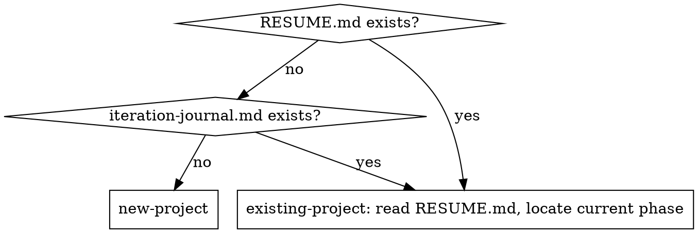

# Project Lifecycle

End-to-end coordinator for traceable, multi-phase project execution. Wraps the existing `superpowers:*` skills with the conventions surfaced during the initial pilot (see `references/origin.md`).

## Core Principle

Every decision, deviation, and review finding must be traceable through git + dated artifacts. Plans always drift; the drift is the most valuable signal — surface it, don't bury it.

## When to Use

- A fresh repository ("let's start a new project") → branch to "new-project" entry
- An existing repository with `RESUME.md` / `iteration-journal.md` → branch to "existing-project" entry
- A milestone is about to start → invoke `superpowers:brainstorming`
- A milestone has a signed-off spec → invoke `superpowers:writing-plans`
- A phase plan is ready → run the per-task cadence below
- A milestone is closing → run the milestone-done gate

**Don't use** for one-off bug fixes, single-file polish, or trivial commits — those don't need the full machinery.

## Entry Detection

## Per-Phase Workflow

For each milestone:

1. **Brainstorm** → `superpowers:brainstorming`. Two-tier storage: append Q&A verbatim to project-wide `docs/brainstorming-qa-log.md`; produce per-phase `docs/superpowers/specs/YYYY-MM-DD-phase-N-<slug>-design.md`. Tag every locked decision with evidence-strength: 🟢 industry pattern (≥3 refs agree) / 🟡 mixed industry / 🔴 AI inference (highest review priority).
2. **Research gate** → for any decision matching the triggers in `references/research-gate.md`, do online research first; cite sources in the spec.
3. **Revision pass** → after each major decision, prompt: "Given this choice, what failure modes might we be missing? Name at least two."
4. **Plan** → `superpowers:writing-plans`. Output: `docs/superpowers/plans/YYYY-MM-DD-phase-N-<slug>.md`.
5. **Branch + execute** → cut a phase-scoped branch (`feat/phase-X.Y-<slug>`, never push direct to main). Use the per-task cadence in `references/cadence.md` (5 steps: implementer → spec review → code review → fixup → journal entry). **One task = one commit; push immediately, no batching.**
6. **Dual-track smoke** → write Track A manual checklist + Track B Playwright (or equivalent) spec. Both required for any user-visible phase. See `references/smoke-tracks.md`.
7. **Phase delivery handoff** → drop `docs/handoff/YYYY-MM-DD-phase-X.Y-handoff.md` covering 8 sections (user-facing list / daily use / file index / smoke / tests / findings / next steps + PR-body appendix). See `references/handoff-template.md`. Findings tier S1/S2/S3 per `references/findings-tier.md`.
8. **PR** → copy handoff §1 + §4 summary + §7 into the PR description body (template in the handoff doc's appendix). User runs Track A → reports findings → AI fixes S1 / logs S2-S3 → merge.
9. **Milestone-done gate** → see `references/milestone-done.md`.

## Per-Task Cadence (5 steps)

See `references/cadence.md` for full detail. Short version:

1. **Dispatch implementer subagent** with the task text + scene-setting context. The controller must add explicit "adapt to existing patterns" guidance and detect first-of-its-kind infra needs.
2. **Spec compliance review** (independent subagent) — did the implementer build exactly what the plan asked, no more, no less?
3. **Code quality review** (independent subagent) — design, security, a11y, perf, forward-looking impact on downstream tasks.
4. **Fixup commit** (separate from the original `feat(...)` commit, never amend or squash). Triage findings via `references/defer-vs-fix.md`.
5. **Journal entry** (separate `docs:` commit) using the 6-section schema in `references/journal-schema.md`.

**Cadence compression** — for trivial mechanical tasks (small diff, no new logic, no security/compliance surface), merge spec + code review into one pass. See `references/cadence.md`.

## Mandatory Conventions

### Commits & branching
- **Atomic commits, push-immediate.** One task = one commit (plus optional fixup + docs:journal). Push after each commit, no batching.
- **Branch + PR for every phase.** Never push direct to main, even for doc-only changes. Branch name: `feat/phase-X.Y-<slug>`.
- **Fixup commits are independent commits.** Never amend a published commit; never squash review history away.
- **Pre-commit / formatter / linter must run locally before commit.** CI catching formatting drift means a wasted push cycle. Never use `--no-verify`; fix the hook complaint instead.
- **Commit message + PR description in English.** Chat / project Q&A can be in the user's preferred language; durable artifacts default to English so they're greppable across projects and reviewers.

### Documentation & traceability
- **Journal "Plan deviations" header is required** even when the body is "none" — its presence forces an active drift check.
- **Evidence-strength tags on locked design decisions** — 🟢 industry pattern (≥3 refs agree) / 🟡 mixed industry / 🔴 AI inference. 🔴 is highest review priority.
- **Mid-phase resume note** — when a phase spans multiple sessions or `/clear` events, drop a `docs/research/YYYY-MM-DD-mX.Y-resume-note.md` capturing what's done, what's next, and the contracts the next session must honor.
- **Backlog discipline** — any deferred decision lands in a backlog file with explicit Trigger + Exit criteria.

### Reviews
- **Three review categories** — spec compliance, code quality, **forward-looking** (works now but downstream task will be hurt). All three are valid reviewer outputs.
- **Blind 2nd-agent revision on locked design decisions** — every major locked decision passes an independent reviewer who does NOT see which option was chosen, to catch self-confirmation bias.

### Smoke & delivery
- **Dual-track smoke is required for user-visible phases** — Track A manual + Track B Playwright (or equivalent). See `references/smoke-tracks.md`.
- **Phase delivery handoff doc is required** before opening the PR. See `references/handoff-template.md`. The doc body lands in the PR description.
- **Findings tier S1/S2/S3** — see `references/findings-tier.md`. S1 blocks merge; S2 ships with follow-up issue; S3 captured for later phase.
- **One-shot test runner** — every project should have a `make phase-checks PHASE=X.Y` (or equivalent) target. Output feeds the handoff doc.

### Cost-aware behaviors
- **Read with offset + limit by default** for files > 200 lines; grep / Explore before Read; never re-read the same file in a session.
- **Compact output flags by default** — `pytest -q`, `vitest --reporter=line`, pipe verbose commands through `tail` / `head`.
- **One-sentence updates between tool calls** — no preamble, no closing pleasantries, no re-summarizing diffs.
- **`/clear` at natural breaks** — handoff doc + RESUME.md + mid-phase resume note make context resets safe.
- Full discipline + tool-adopt list (RTK / token-savior / context-mode / code-review-graph) in `references/cost-aware-behaviors.md`.

## Quick Reference

| Situation | Action |
|---|---|
| New decision, non-trivial | Research first; cite in spec; do revision pass |
| Small mechanical task | Compress cadence (merge reviewers) |
| Plan snippet conflicts with existing code | Tell implementer to adapt; document in journal "Plan deviations" |
| First task touching a new tooling category | Insert bootstrap step or augment implementer prompt |
| Reviewer finds Important issue | Apply defer-vs-fix triage |
| Codegen artifact change | Regen lands in same commit as source change |
| Milestone closing | Run milestone-done gate |

## Red Flags — STOP

- Plan author skips brainstorming because "the spec is obvious" → don't.
- Implementer copies plan code verbatim without checking for codebase conventions → controller failed; re-dispatch.
- Reviewer says "approved" with open Important findings → apply defer-vs-fix; don't approve until triaged.
- Journal entry omits "Plan deviations" → blocked; cannot close task.
- `feat(...)` commit amended after review → blocked; create a fixup commit instead.
- Pre-commit ran only at PR time → fix locally before next commit.
- PR opened without a handoff doc → blocked; write the handoff first, then open PR with its body.
- Phase claims "done" without dual-track smoke artifacts → not done; ship checklist + e2e first.
- Handoff §1 reads like a changelog full of jargon → rewrite for product-owner audience (daily language, "I can now..." voice).

## References

- `references/cadence.md` — full per-task workflow, including controller responsibilities and compression conditions
- `references/journal-schema.md` — 6-section journal entry template with examples
- `references/research-gate.md` — when online research is required before deciding
- `references/defer-vs-fix.md` — triage rule for review findings
- `references/milestone-done.md` — closing-the-milestone checklist
- `references/handoff-template.md` — phase delivery doc structure + PR body shape
- `references/smoke-tracks.md` — dual-track smoke contract (A manual + B Playwright)
- `references/findings-tier.md` — S1/S2/S3 triage for findings and known limitations
- `references/cost-aware-behaviors.md` — per-token leverage rules + tool-adopt tiers (RTK / token-savior / etc.)
- `references/origin.md` — pilot history and the requirements doc that produced this skill

## Underlying Skills (do NOT reimplement — call them)

- `superpowers:brainstorming` — Q&A capture
- `superpowers:writing-plans` — implementation plan generation
- `superpowers:subagent-driven-development` — per-task execution loop
- `superpowers:test-driven-development` — tests-first
- `superpowers:verification-before-completion` — pre-completion checks
- `superpowers:requesting-code-review` / `receiving-code-review` — review interaction
- `superpowers:finishing-a-development-branch` — merge decisions
- `superpowers:using-git-worktrees` — isolation when needed
