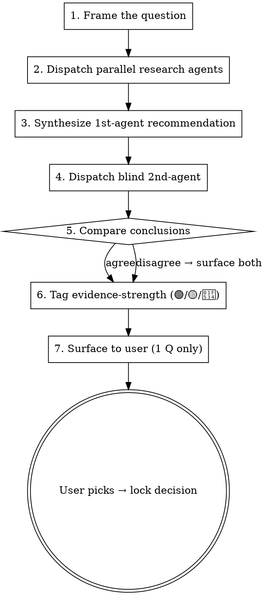

# Brainstorm Research Protocol

How to run a single brainstorm question end-to-end without skipping research, without rubber-stamping the AI's first opinion, and without dumping a wall of options on the user.

The core rule: **never ask the user to choose without research first.** Recommendations are welcome; un-backed recommendations are not.

## Mode selection (ASK FIRST, before any question)

At the start of every brainstorm session, ask the user which mode they prefer. Phrase the prompt in whatever language the user has been writing in; the choice itself is what matters. Sample English version:

> "Phase M<X>.<Y> has N open decisions. Pick a delivery mode:
>
> **A — Interactive (one-by-one)**: I'll present one question at a time. For each: dispatch research, draft a recommendation, run a blind 2nd-agent verification, then surface to you for sign-off before moving to the next question. Slower wall-clock; lets you redirect mid-stream.
>
> **B — Batch (all-at-once)**: I'll run all N questions end-to-end (research + 2nd-agent + recommendation each), write the full Q&A to `docs/brainstorming-qa-log.md` with citations, and ping you with one review pass. Faster wall-clock; bigger commit; harder to redirect once started."

Wait for user choice. Default if user does not pick: ask again — never assume.

Both modes use the same 7-step per-question protocol below. They differ only in **delivery cadence**:

- **Mode A**: surface step 7 to user immediately after each Q completes; wait for user lock before starting next Q.
- **Mode B**: surface all Qs at once after every Q has run through steps 1-6; write everything to the doc first, then ping user with a single "ready for review" message pointing to the doc.

## Recording is mandatory regardless of mode

Every brainstorm session writes to `docs/brainstorming-qa-log.md` with:

- **Verbatim user message** that triggered the brainstorm — copy exactly, no paraphrase.
- **Verbatim controller framing** — the exact Q text presented to user.
- **All research citations** — every URL from every dispatched agent, deduplicated, ordered by Tier (1 then 2).
- **1st-agent reasoning** — verbatim or near-verbatim, not summarized.
- **2nd-agent reasoning** — verbatim, including disagreement details if any.
- **User decision text** — verbatim, including any nuance or constraint they added.

See "Documenting the Q&A" section at end of this doc for the entry template. Citations are NOT optional even for compressed (skip-2nd-agent) decisions — minimum 1 research link per locked decision, even if it's a single doc page.

## The 7-step per-question loop



## Step 0 — Language-first pass (BEFORE Step 1)

Before framing any implementation Q, run a vocabulary sweep against the project's CONTEXT.md (or CONTEXT-MAP for multi-context repos). Per `references/context-md.md`:

1. **Read CONTEXT.md / CONTEXT-MAP.md.** If neither exists, plan to create CONTEXT.md lazily during this brainstorm — note the intent up front; create when the first term resolves.
2. **Scan the user-message text** for terms that are: (a) fuzzy / vague, (b) overloaded (same word, different meanings), (c) missing from the glossary, or (d) conflicting with an existing definition.
3. **Sharpen + resolve** each flagged term before drafting the implementation Q. Options:
   - Propose a canonical term + add aliases under `_Avoid:_`
   - Surface the ambiguity to the user: "you said 'account' — do you mean **Customer** or **User**? These are distinct in our glossary."
   - Invent a new term + add to CONTEXT.md if the concept isn't covered yet (lazy creation)
4. **Cross-reference w/ code** when user states how something works. If code disagrees, surface it: "you said partial cancellation is possible, but `cancel_order()` cancels the whole order — which is right?"
5. **Update CONTEXT.md inline** as each term gets resolved. Same turn, not batched.

Only after vocabulary is sharp do you proceed to Step 1 framing. Asking design Qs over fuzzy vocabulary produces fuzzy answers + verbose AI replies.

**Skip Step 0 only when:** the Q is a trivial mechanical detail w/ no domain-vocabulary surface (file naming, lint config, etc.). For any decision touching domain concepts, Step 0 is mandatory.

## Step 1 — Frame the question

One discrete decision. If the question fans out into 3 sub-questions, split it. Bad: "how should the report page work?" Good: "what period presets ship in v1?"

State the decision space concretely. Bad: "what about export?" Good: "export format v1 — PDF / Excel / both / neither?"

Use CONTEXT.md vocabulary in the framing. If the framing requires a term not in the glossary yet, that's a Step 0 miss — back up and resolve the term first.

## Step 2 — Dispatch parallel research agents

For every question, **dispatch parallel research agents** that survey reference products before you draft an answer. Use the `Agent` tool with `subagent_type: "general-purpose"` and `run_in_background: false` (or true if you have other independent work).

Two-tier survey is mandatory for any UX or design-pattern question:

| Tier | Purpose | Typical refs |
|---|---|---|
| **Tier 1 — Advanced / professional** | Technical correctness; what compliance-aware or expert-grade products do | Project-specific list lives in `CLAUDE.md`. Examples by domain: accounting → Xero / QuickBooks; project mgmt → Jira / Linear; design tools → Figma / Sketch; CRM → Salesforce / HubSpot |
| **Tier 2 — Novice / consumer** | UX that works for non-expert audience | Project-specific list lives in `CLAUDE.md`. Examples by domain: accounting → YNAB / Monarch; project mgmt → Notion / Trello; design → Canva; CRM → Pipedrive / consumer-focused alternatives |

Tier 1 alone is a trap — "technically correct but unusable by the actual audience." Tier 2 alone is a trap — "loved by users, fails compliance." Both must report.

For non-UX questions (BE architecture, perf strategy, data shape), single-tier is fine but still cite ≥2 reference products / sources.

Prompt template for the dispatched agent:

```
You are surveying how reference products handle <decision>. Do NOT propose a
recommendation. Just report what each product does + cite source URLs.

Tier <N> targets: <project-specific list from CLAUDE.md>

Required output (under 500 words):
- Per-product summary: what default, what config knobs, what trade-offs
- Source URLs (docs, blog posts, screenshots if possible)
- Patterns that ≥N products share
- Outlier patterns and the products that picked them

Do NOT cover other questions. Do NOT recommend.
```

Run Tier 1 + Tier 2 in parallel (single message, multiple `Agent` calls). Wait for both to return.

## Step 3 — Synthesize 1st-agent recommendation

You (the controller) read both research outputs and produce a recommendation with citations baked in.

Required shape:

```
**Recommendation:** <option name>

**Why this wins on <audience priority from CLAUDE.md>:**
- Tier 1 evidence: ProductA does X (URL), ProductB does X (URL), ProductC does X (URL) → industry pattern
- Tier 2 evidence: ProductD does X (URL), ProductE does X (URL) → confirms novice-friendly
- Trade-offs ruled out: option B because <reason>, option C because <reason>

**Citations:** [list of 4-6 URLs]
```

If the research surfaces patterns the original question didn't anticipate (e.g. you asked "PDF vs Excel" and discover ≥3 products ship both as separate buttons in one row), surface that as an option even though it wasn't in the original frame.

## Step 4 — Dispatch blind 2nd-agent

Fresh `Agent` instance. Show the agent:
- The question
- All candidate options (including your synthesized option)
- The research outputs from step 2 verbatim

**DO NOT** show the agent:
- Your 1st-agent recommendation
- Your reasoning for picking the recommendation
- Any hint of which option you favor

Prompt template:

```
You are reviewing options for a design decision. Independent analysis only —
no rubber-stamping.

Question: <decision>
Audience priority: <from CLAUDE.md, e.g. "novice users, UX simplicity over feature breadth">

Options:
- A: <description>
- B: <description>
- C: <description>

Research findings: <verbatim from step 2>

Required output:
1. Your independent recommendation + 2-3 sentence rationale
2. The strongest hole in each option you didn't pick
3. Anything missing from the options list (a 4th option you'd consider)
4. Any failure mode you'd worry about
```

The agent's job is to disagree if disagreement is warranted. If it always agrees with the controller's instinct, the protocol is broken (controller leaked their preference). Fix the prompt, re-run.

## Step 5 — Compare conclusions

Two cases:

**Agree** — both agents converge on the same option. Lock it. Document side-by-side reasoning in the brainstorm Q&A entry so the agreement is auditable later.

**Disagree** — surface the disagreement to the user. Do not paper over it. Format:

```
**Disagreement:**
- 1st-agent picked A because <reason>.
- 2nd-agent picked B because <reason>.
- Independent factor that decides: <e.g. "for our novice audience, B's
  simpler default outweighs A's compliance edge — but only if you're OK
  with the compliance gap">.
```

Then ask user to break the tie. **Never** silently pick after disagreement.

## Step 6 — Tag evidence-strength

Apply 🟢 / 🟡 / 🔴 to the locked recommendation:

| Tag | When | User review priority |
|---|---|---|
| 🟢 **Industry pattern** | ≥3 refs (across both tiers) do the same thing AND 2nd-agent agreed AND no major failure mode | Skim |
| 🟡 **Mixed industry** | Refs split, or 1st & 2nd agent split, or audience trade-off explicit | Read rationale |
| 🔴 **AI inference** | <3 refs, or 2nd-agent disagreed AND user picked controller's option, or no good ref product exists for this decision | **Must review carefully** |

Bias toward downgrading: 🟢 → 🟡 if unsure, 🟡 → 🔴 if unsure. False-positive review costs nothing; false-negative ships a UX miss.

## Step 7 — Surface to user (one question only)

Single message. Format:

```
**Q<N>: <question>**

Tentative recommendation: <option> [🟢 / 🟡 / 🔴]

**Why** (research-backed):
- Tier 1: <product> does X (URL); <product2> does X (URL)
- Tier 2: <product> does X (URL); <product2> does X (URL)
- 2nd-agent: confirmed / suggested revision <X>

**Trade-offs ruled out:**
- Option B because <reason>
- Option C because <reason>

**Open factor for you to weigh:** <if any — surface it explicitly>
```

If a structured choice UI is available, present 2-4 options with the recommendation marked, but the message body must still carry the research summary so the user can override on substance.

**Hard rule:** ONE question per message. No "and while we're here, also Q5 + Q6 + Q7." If you've drafted 4 Q's, ask Q1, wait for the answer, then ask Q2.

## Banned patterns

- **"Two options: A or B. What do you prefer?"** — no research baseline. User has nothing to anchor on.
- **"I recommend X because [my opinion]"** — opinion alone. Must cite ≥1 reference product or industry-standard source.
- **Asking a list of 4+ questions in one message** — overloads the user, makes per-decision research impossible to surface clearly.
- **Skipping the blind 2nd-agent because "the answer is obvious"** — obvious answers are where confirmation bias hides. The 2nd-agent step is cheap. Run it.
- **Inventing flow shapes / labels / defaults** without checking what reference products do. Inventing patterns is a regression vs surveying the field.
- **Tier 1 only** for UX decisions — too-professional design, fails novice audience.
- **Tier 2 only** for compliance-touching decisions — friendly but non-compliant ships legal risk.
- **Asking the user a Q that codebase exploration could answer** — dispatch `Explore` subagent first. If exploration resolves the Q, drop it; if it narrows the Q, present grounded options. Asking what `grep` answers wastes user time.
- **Skipping Step 0 language-first pass** — asking design Qs over fuzzy vocabulary produces fuzzy answers + drift between code names ↔ spec names. CONTEXT.md sweep is non-negotiable for domain-touching Qs.

## Documenting the Q&A

Each brainstorm session lands in the project-wide `docs/brainstorming-qa-log.md`. The file must carry an index at the top (see `references/document-indexing.md`) — every per-phase section gets an anchor link.

**Per-phase section template:**

```markdown
## Mx.y — <phase name> — <YYYY-MM-DD>

**Mode chosen:** A (interactive) / B (batch)

**Trigger (verbatim user message):**
> <copy the user's literal request that started the brainstorm>

**Controller framing (verbatim, the message I sent back to user):**
> <copy the exact framing message — what surfaced as the Q to user>

### Q<N>: <question> — <YYYY-MM-DD HH:MM>

**Locked:** <option> [🟢 / 🟡 / 🔴]

**Research dispatched:**
- Tier 1 (Advanced/Professional): <agent prompt summary>
- Tier 2 (Novice/Consumer): <agent prompt summary>

**Citations (verbatim URLs from research):**
- Tier 1:
  - <URL 1> — <product/source> says X
  - <URL 2> — <product/source> says Y
- Tier 2:
  - <URL 3> — <product/source> says Z
  - <URL 4> — <product/source> says W

**1st-agent reasoning (verbatim):**
> <do not paraphrase; copy the synthesis>

**2nd-agent reasoning (verbatim):**
> <copy what 2nd agent independently concluded; include the disagreement text if any>

**Agreement:** agree / disagree (resolved by <user / evidence-strength tiebreak>)

**Failure modes (revision pass):**
1. <when it bites / how detected / rollback>
2. <when it bites / how detected / rollback>

**User decision (verbatim):**
> <copy what user typed, including any nuance/constraint they added>

**Resolution date:** <YYYY-MM-DD>
```

A locked Q is NEVER deleted from the log. If the user later changes their mind, append a new entry "Q<N>-revisited: <reason>" — keep the original as audit trail.

## When to compress

For questions that pass these tests, you may compress the protocol:

- The decision matches an established pattern already locked in a previous phase of the same project (e.g. "use the same date-range preset list as a prior phase's filter")
- The decision is a trivial mechanical detail (file naming, import order, etc.) with no UX or compliance surface
- The user has explicitly said "go fast, skip the protocol on this one"

Compression = skip step 4 (blind 2nd-agent) and tag as 🟢 if matching an established pattern. **Never** skip step 2 (research) — even a 1-paragraph cite is enough.

## Anti-pattern recovery

If you realize mid-brainstorm that you've been asking the user to opinion-poll without research:

1. **Stop.** Acknowledge the skip explicitly.
2. **Demote** any "answered" question from "locked" to "tentative preference."
3. **Re-run** the full protocol on each tentative question (research → 1st rec → 2nd-agent → surface with evidence tag).
4. The user's tentative answer is a useful prior — surface it as "you leaned toward X earlier; here's the research-backed verification of that choice" — but don't treat it as locked.
