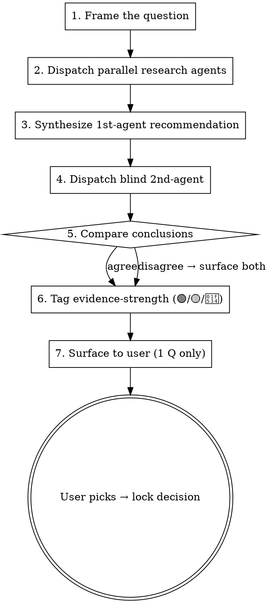

# Brainstorm Research Protocol

How to run a single brainstorm question end-to-end without skipping research, without rubber-stamping the AI's first opinion, and without dumping a wall of options on the user.

The core rule: **never ask the user to choose without research first.** Recommendations are welcome; un-backed recommendations are not.

**Two callers read this one protocol.** Inside a brainstorm, the per-question loop below runs as part of the Mode A/B cadence and locks a decision into the qa-log. Standalone, the `/research` command (`commands/research.md`) runs steps 1-3 (+4-5 unless `--quick`) on a single question and writes a **cited report** to `docs/research/` — no decision lock, no qa-log entry. Both entry points share this doc as the single source of truth; neither forks it.

## Mode selection (ASK FIRST, before any question)

At the start of every brainstorm session, ask the user which mode they prefer. Phrase the prompt in whatever language the user has been writing in; the choice itself is what matters. Sample English version:

> "Phase M<X>.<Y> has N open decisions. Pick a delivery mode:
>
> **A — Interactive (one-by-one)**: I'll present one question at a time. For each: dispatch research, draft a recommendation, run a blind 2nd-agent verification, then surface to you for sign-off before moving to the next question. Slower wall-clock; lets you redirect mid-stream.
>
> **B — Batch (all-at-once)**: I'll run all N questions end-to-end (research + 2nd-agent + recommendation each), write the full Q&A to the branch's `docs/qa-log.d/<date>-<branch-slug>.md` fragment with citations, and ping you with one review pass. Faster wall-clock; bigger commit; harder to redirect once started."

Wait for user choice. Default if user does not pick: ask again — never assume.

Both modes use the same 7-step per-question protocol below. They differ only in **delivery cadence**:

- **Mode A**: surface step 7 to user immediately after each Q completes; wait for user lock before starting next Q.
- **Mode B**: surface all Qs at once after every Q has run through steps 1-6; write everything to the fragment first, then hand the batch back in a single "ready for review" message that **carries the sheet itself** — the completed entries, not a path to them. Name the fragment's path too, so the reader knows where the canonical artifact lives, but the path is a pointer alongside the content, never the delivery. A reader who has to go open a file before they can start deciding has been handed homework instead of a review.

**Both modes write the same entry** (see "Documenting the Q&A" below) — a two-state record that starts at `Status: PROPOSED` and is edited **in place** to `Status: LOCKED` once the user answers. Mode A transits both states inside one turn; Mode B leaves every Q sitting at PROPOSED until the review pass. One schema, one file, one entry per question — never a separate "review sheet" document that is merged back later.

**Hard rule — no complete sheet, no ping.** Mode B's "ready for review" message is **blocked** until the doc exists and *every* question in the batch carries *every* field marked required for PROPOSED in the authoritative table under §"Documenting the Q&A" → "The two states". A batch surfaced against a missing, partial, or stubbed sheet is a **malformed message** — same register as "no citation, no send" (§Step 7): not a message you forgot to finish, a message you must not send. A missing field means steps 1-6 are not finished — go back and finish them. Handing over a sheet you did not actually finish writing is the specific failure this rule exists to prevent; surfacing the content rather than a path makes a stubbed entry visible on arrival instead of at the moment the reader opens the file, but it does not lower the bar — the gate is the same, and it is checked before the message is sent, not after.

**This does not license batching *questions* into one message.** The "one question per message" hard rule (§Step 7) is about **interactive surfacing** — never make the user answer 4 questions out of one wall of text. Mode B's ping delivers the batch as a **sheet** — each question in its own self-contained entry, read at the reader's own pace and in whatever order they choose — not as N questions stacked into a conversational turn demanding N answers back. Any follow-up asked back in conversation is still one at a time. Mode B changes *how* the batch is read, not whether the user is made to juggle N questions in a chat turn.

## Recording is mandatory regardless of mode

Every brainstorm session writes to the current branch's `docs/qa-log.d/<date>-<branch-slug>.md` fragment (one fragment per branch — append to it if it already exists, per `references/retention.md` §"Fragment convention") with:

- **Verbatim user message** that triggered the brainstorm — copy exactly, no paraphrase.
- **Verbatim controller framing** — the exact Q text presented to user.
- **All research citations** — every URL from every dispatched agent, deduplicated, ordered by Tier (1 then 2).
- **1st-agent reasoning** — verbatim or near-verbatim, not summarized.
- **2nd-agent reasoning** — verbatim, including disagreement details if any.
- **User decision text** — verbatim, the quote and nothing else. Do not fold anything into it.
- **The constraint or caveat attached while deciding** — recorded separately, in `Decision note`. A
  nuance folded into the quote is unfindable, which is the whole reason it has its own field.

**Fallback (un-adopted projects):** if the repo hasn't wired up `docs/qa-log.d/`, write directly to the project-wide `docs/brainstorming-qa-log.md` monolith instead — this remains a fully supported path, just not the default for projects that have adopted the fragment convention.

See "Documenting the Q&A" section at end of this doc for the entry template. Citations are NOT optional even for compressed (skip-2nd-agent) decisions — minimum 1 research link per locked decision, even if it's a single doc page.

## Reference-share capture (byproduct — gated, armed by key)

Separate from recording the Q&A: during the research loop the user often **shares an external
reference** for you to analyze (a repo/paper/blog/tool/video/talk link, an offline doc dropped in
by local path / DOI such as a downloaded PDF, or an explicitly-shared AI-chat log / screenshot /
pasted note — illustrative, not exhaustive; the log header's `Type` enum is the live source).
When such an offer-worthy reference is shared **and**
the user-global `references-log:` key is armed, fire the gated capture offer from
`references/references-log.md` — "log this to your references-log? y/n", never silent. This
mirrors the intent-gate's "Capture trigger — rationale signals" byproduct pattern: it rides the
research you're already doing, at most one plain y/n, and skips rather than nags when unsure.
Keep the bar high (offer-worthy guard in `references/references-log.md`); it is off entirely
when the key is unset.

## Ordering the decisions (dependency-first)

Before running the per-question loop, **order the phase's open decisions by dependency and walk
the tree upstream-first** — resolve a decision before the decisions whose *option space* depends
on its lock. The decision-tree-traversal framing here was inspired by Matt Pocock's `grilling`
skill ([`mattpocock/skills`](https://github.com/mattpocock/skills), MIT), which likewise resolves a plan's decisions branch by branch in
dependency order.

Why order matters: a downstream question's candidate options often only exist once an upstream
choice is locked. Asking "which export columns?" before "export format — PDF or Excel?" wastes a
round — the column set differs per format. Lock the format first; the column question reshapes.

Practical rule:

1. **List the N open decisions**, then sketch the dependency edges (A must lock before B when B's
   options change with A). A one-line-per-edge note in the qa-log is enough; no formal graph.
2. **Resolve roots first** — decisions with no unlocked upstream. Only surface a downstream Q once
   every decision it depends on is locked.
3. **When a lock reshapes a downstream Q**, re-frame that Q against the new constraint before
   surfacing it (its options may have shrunk, or a new option may have appeared).
4. **Independent decisions** (no edges between them) may be surfaced in any order — in Mode B they
   can all run in parallel through steps 1-6.

This is orthogonal to the "one question per message" rule: ordering decides *which* question is
next; the per-message rule still means you surface exactly one at a time.

## The 7-step per-question loop



## Step 0 — Language-first pass (BEFORE Step 1)

Before framing any implementation Q, run a vocabulary sweep against the project's CONTEXT.md (or CONTEXT-MAP for multi-context repos). Per `references/context-md.md`:

1. **Read CONTEXT.md / CONTEXT-MAP.md.** If neither exists, plan to create CONTEXT.md lazily during this brainstorm — note the intent up front; create when the first term resolves.
2. **Scan the user-message text** for terms that are: (a) fuzzy / vague, (b) overloaded (same word, different meanings), (c) missing from the glossary, or (d) conflicting with an existing definition.
3. **Sharpen + resolve** each flagged term before drafting the implementation Q. Options:
   - Propose a canonical term + add aliases under `_Avoid:_`
   - Surface the ambiguity to the user: "you said 'account' — do you mean **Customer** or **User**? These are distinct in our glossary."
   - Invent a new term + add to CONTEXT.md if the concept isn't covered yet (lazy creation)
4. **Cross-reference w/ code** when user states how something works. If code disagrees, surface it: "you said partial cancellation is possible, but `cancel_order()` cancels the whole order — which is right?"
5. **Update CONTEXT.md inline** as each term gets resolved. Same turn, not batched.

Only after vocabulary is sharp do you proceed to Step 1 framing. Asking design Qs over fuzzy vocabulary produces fuzzy answers + verbose AI replies.

**Skip Step 0 only when:** the Q is a trivial mechanical detail w/ no domain-vocabulary surface (file naming, lint config, etc.). For any decision touching domain concepts, Step 0 is mandatory.

## Step 1 — Frame the question

One discrete decision. If the question fans out into 3 sub-questions, split it. Bad: "how should the report page work?" Good: "what period presets ship in v1?"

State the decision space concretely. Bad: "what about export?" Good: "export format v1 — PDF / Excel / both / neither?"

Use CONTEXT.md vocabulary in the framing. If the framing requires a term not in the glossary yet, that's a Step 0 miss — back up and resolve the term first.

## Step 2 — Dispatch parallel research agents

For every question, **dispatch parallel research agents** that survey reference products before you draft an answer. Use the `Agent` tool with `subagent_type: "general-purpose"` and `run_in_background: false` (or true if you have other independent work).

Two-tier survey is mandatory for any UX or design-pattern question:

| Tier | Purpose | Typical refs |
|---|---|---|
| **Tier 1 — Advanced / professional** | Technical correctness; what compliance-aware or expert-grade products do | Project-specific list lives in `CLAUDE.md`. Examples by domain: accounting → Xero / QuickBooks; project mgmt → Jira / Linear; design tools → Figma / Sketch; CRM → Salesforce / HubSpot |
| **Tier 2 — Novice / consumer** | UX that works for non-expert audience | Project-specific list lives in `CLAUDE.md`. Examples by domain: accounting → YNAB / Monarch; project mgmt → Notion / Trello; design → Canva; CRM → Pipedrive / consumer-focused alternatives |

Tier 1 alone is a trap — "technically correct but unusable by the actual audience." Tier 2 alone is a trap — "loved by users, fails compliance." Both must report.

For non-UX questions (BE architecture, perf strategy, data shape), single-tier is fine but still cite ≥2 reference products / sources.

Prompt template for the dispatched agent:

```
You are surveying how reference products handle <decision>. Do NOT propose a
recommendation. Just report what each product does + cite source URLs.

Tier <N> targets: <project-specific list from CLAUDE.md>

Required output (under 500 words):
- Per-product summary: what default, what config knobs, what trade-offs
- Source URLs (docs, blog posts, screenshots if possible)
- Patterns that ≥N products share
- Outlier patterns and the products that picked them

Do NOT cover other questions. Do NOT recommend.
```

Run Tier 1 + Tier 2 in parallel (single message, multiple `Agent` calls). Wait for both to return.

## Step 3 — Synthesize 1st-agent recommendation

You (the controller) read both research outputs and produce a recommendation with citations baked in.

Required shape — **criteria, then evidence, then the pick, in that order.**

```
**Engine:** <what is producing this synthesis — e.g. `claude-opus-4-8` (controller)>

**Criteria — what would make one option win here:**
- <axis 1, from the audience priority in CLAUDE.md>
- <axis 2>

**Evidence:**
- Tier 1 evidence: ProductA does X (URL), ProductB does X (URL), ProductC does X (URL) → industry pattern
- Tier 2 evidence: ProductD does X (URL), ProductE does X (URL) → confirms novice-friendly
- Trade-offs ruled out: option B because <reason>, option C because <reason>

**Citations:** [list of 4-6 URLs]

**Recommendation:** <option name> [🟢 / 🟡 / 🔴]
```

These map onto the entry's `1st-agent engine` / `1st-agent criteria` / `1st-agent reasoning (verbatim)` / `Citations` / `1st-agent independent pick` — same order, same names.

If the research surfaces patterns the original question didn't anticipate (e.g. you asked "PDF vs Excel" and discover ≥3 products ship both as separate buttons in one row), surface that as an option even though it wasn't in the original frame.

## Step 4 — Dispatch blind 2nd-agent

**Discoverability offer (first step-4 only, key-absence gated).** Before resolving the key: if this is the **first** step-4 in the project AND `second-agent-family` is **absent** from CLAUDE.md (project + user-global) AND a foreign CLI is detected present+authed (reuse `scripts/cross-family-review.sh`'s availability probe), make the **one-time** offer to arm cross-family review per `references/cross-family-review.md` §"Discoverability". Decline → write `second-agent-family: off` (never re-ask); accept → write `foreign:codex` (the D4 consent still fires separately at first spawn — the offer does not grant it). If no foreign CLI is installed OR the key is already set to anything, skip the offer silently (byte-identical). Then resolve the key:

**Engine resolution (armed-optional cross-family — `second-agent-family` key, default `auto`).** Resolve the key per `references/cross-family-review.md`:
- `auto` / `same-family` / unset → a fresh **same-family `Agent` instance** (everything below, unchanged — byte-identical to a repo without this key).
- `foreign:codex` (or another armed family) → build a **synthesized decision packet** (the same inputs shown below — question + options + step-2 research, and NOTHING the same-family agent is forbidden to see), take arm-time consent if not yet given, and invoke `scripts/cross-family-review.sh --family codex --packet <packet> --out <result>`. On `status:succeeded` use the foreign pick; on `status:fallback(<reason>)` fall back to the same-family `Agent` instance below. **Either way stamp the qa-log `2nd-agent engine:` + `2nd-agent status:` fields** (`same-family` / `foreign:codex` + `succeeded|fallback(<reason>)`) so the record never claims a cross-family review that silently didn't happen. A foreign reviewer NEVER blocks or overrides — it is a dissent source; disagreement surfaces to the human exactly as the same-family path (step 5).

Fresh `Agent` instance (the same-family path, and the fallback target for every foreign gate failure). Show the agent:
- The question
- All candidate options (including your synthesized option)
- The research outputs from step 2 verbatim

**DO NOT** show the agent:
- Your 1st-agent recommendation
- Your reasoning for picking the recommendation
- Any hint of which option you favor

Prompt template:

```
You are reviewing options for a design decision. Independent analysis only —
no rubber-stamping.

Question: <decision>
Audience priority: <from CLAUDE.md, e.g. "novice users, UX simplicity over feature breadth">

Options:
- A: <description>
- B: <description>
- C: <description>

Research findings: <verbatim from step 2>

Required output, in this order:
1. The criteria you are judging on — the axes that would make one option win.
   State these BEFORE naming a winner; committing to the axes first is what stops
   the criteria from being reverse-engineered out of a pick you already liked.
2. The strongest hole in each option, including the one you end up picking.
3. Your independent recommendation + 2-3 sentence rationale
4. Anything missing from the options list (a 4th option you'd consider)
5. Any risk you'd worry about with your pick
```

**The output order is load-bearing, not a formatting preference.** Outputs 1 and 2 are recorded whole and **above** the pick; output 3 is the one that splits — its rationale is appended to `2nd-agent reasoning (verbatim)`, and only its option name goes to `2nd-agent independent pick`. Asking for the pick before outputs 1 and 2 would have the agent name a winner and only then produce the criteria and the case against each option, leaving the entry to be assembled evidence-first by transcription — which is the shape of a rationalization, not of reasoning.

Output 2 deliberately covers **every** option including the one the agent goes on to pick: a reviewer that only finds fault with what it rejected has not reviewed its own choice. Keep it distinct from output 5 — output 2 is the case against the option *as an option*, weighed before choosing; output 5 is what could go wrong *after* this pick is adopted, which is why it lands in `Risks` alongside cross-check agent A's lines rather than in the reasoning.

The agent's job is to disagree if disagreement is warranted. If it always agrees with the controller's instinct, the protocol is broken (controller leaked their preference). Fix the prompt, re-run.

**Every numbered output above has a named home in the entry template** — record them there, do not let them live only in the prose summary. *(Brainstorm caller only. The `/research` caller runs this step but does **not** write a qa-log entry — it carries these outputs into its `docs/research/` report instead.)*

| Prompt output | Entry field |
|---|---|
| 1 — criteria judged on | `**2nd-agent criteria:**` — recorded above its pick, in that order, so a reader can see two different picks as two different standards rather than as a bare contradiction |
| 2 — strongest hole in each option | `**2nd-agent reasoning (verbatim):**` |
| 3 — independent recommendation | `**2nd-agent independent pick:**` (the option name) + `**2nd-agent reasoning (verbatim):**` (the rationale, appended after output 2) |
| 4 — anything missing / a 4th option | `**2nd-agent's own suggestion:**` — write `none` explicitly when the agent offers nothing; an empty field is indistinguishable from a skipped step |
| 5 — risks | `**Risks (what could go wrong with this choice):**`, each line tagged with its producer — tag these `2nd agent`, so they stay distinguishable from the ones cross-check agent A adds later |

Outputs 1-3 are emitted in the same order they are recorded, so the entry is transcribed straight down rather than reassembled — the reordering is the point, and an entry built by shuffling a verdict-first response back into an evidence-first shape defeats it.

Also stamp `**2nd-agent engine:**` with what actually produced the verdict (`same-family` or `foreign:<name>`, e.g. `foreign:codex`), `**Same family:**` with `yes` / `no` by comparing it against `**1st-agent engine:**`, and — when a foreign family was armed — `**2nd-agent status:**` with `succeeded` or `fallback(<reason>)` (reason ∈ not-installed / not-authed / spawn-failed / unparseable / timed-out / declined-install / unsupported-family). Before this feature, the answer was always `Same family: yes` — a same-family subagent; the `second-agent-family` key (`references/cross-family-review.md`) makes `no` achievable by running the 2nd agent on a different CLI family. The status field is what keeps the record honest: a silent fallback to the same-family subagent must read `foreign:codex` + `fallback(<reason>)`, never a bare `Same family: no` that claims a cross-family review which did not actually run. `Same family` (and `2nd-agent status` when armed) is never omitted, and never left blank because it looked obvious.

A dispatched 2nd agent whose pick never reaches the entry is **work paid for and thrown away** — the independent choice is the entire deliverable of this step.

## Step 5 — Compare conclusions

Two cases:

**Agree** — both agents converge on the same option. Lock it. Document side-by-side reasoning in the brainstorm Q&A entry so the agreement is auditable later.

**Disagree** — surface the disagreement to the user. Do not paper over it. Format:

```
**Disagreement:**
- 1st-agent picked A because <reason>.
- 2nd-agent picked B because <reason>.
- Independent factor that decides: <e.g. "for our novice audience, B's
  simpler default outweighs A's compliance edge — but only if you're OK
  with the compliance gap">.
```

Then ask user to break the tie. **Never** silently pick after disagreement.

## Step 6 — Tag evidence-strength

Apply 🟢 / 🟡 / 🔴 to the locked recommendation:

| Tag | When | User review priority |
|---|---|---|
| 🟢 **Industry pattern** | ≥3 refs (across both tiers) do the same thing AND 2nd-agent agreed AND no major entry under `Risks` | Skim |
| 🟡 **Mixed industry** | Refs split, or 1st & 2nd agent split, or audience trade-off explicit | Read rationale |
| 🔴 **AI inference** | <3 refs, or 2nd-agent disagreed AND user picked controller's option, or no good ref product exists for this decision | **Must review carefully** |

Bias toward downgrading: 🟢 → 🟡 if unsure, 🟡 → 🔴 if unsure. False-positive review costs nothing; false-negative ships a UX miss.

## Step 7 — Surface to user (one question only)

Single message. Format:

```
**Q<N>: <question>**

Tentative recommendation: <option> [🟢 / 🟡 / 🔴]

**Why** (research-backed):
- Tier 1: <product> does X (URL); <product2> does X (URL)
- Tier 2: <product> does X (URL); <product2> does X (URL)
- 2nd-agent: confirmed / suggested revision <X>

**Trade-offs ruled out:**
- Option B because <reason>
- Option C because <reason>

**Open factor for you to weigh:** <if any — surface it explicitly>
```

If a structured choice UI is available, present 2-4 options with the recommendation marked, but the message body must still carry the research summary so the user can override on substance.

**Hard rule — one question per message.** No "and while we're here, also Q5 + Q6 + Q7." If you've drafted 4 Q's, ask Q1, wait for the answer, then ask Q2.

**Hard rule — no citation, no send.** A surfaced recommendation whose "**Why** (research-backed)" block carries zero citation URLs is a **malformed message** — not a message you forgot to finish, a message you must not send. Treat a missing citation line the way you'd treat a syntax error: it blocks output. If you're about to present a decision and the research lines are empty, you skipped step 2 — go back and run it, or (if it genuinely qualifies) compress it *and cite the one URL that compression still requires*. There is no valid surfaced decision with an empty citation block.

## Banned patterns

- **"Two options: A or B. What do you prefer?"** — no research baseline. User has nothing to anchor on.
- **"I recommend X because [my opinion]"** — opinion alone. Must cite ≥1 reference product or industry-standard source.
- **Asking a list of 4+ questions in one message** — overloads the user, makes per-decision research impossible to surface clearly.
- **Skipping the blind 2nd-agent because "the answer is obvious"** — obvious answers are where confirmation bias hides. The 2nd-agent step is cheap. Run it.
- **Compress-by-default — declaring decisions "trivial / standard" to skip research** — the single most common way this protocol silently degrades. Compression is a named, justified exception (see "When to compress"); if you can't name which criterion applies, run the full loop. Skipping research is never one of the things compression buys you.
- **Inventing flow shapes / labels / defaults** without checking what reference products do. Inventing patterns is a regression vs surveying the field.
- **Tier 1 only** for UX decisions — too-professional design, fails novice audience.
- **Tier 2 only** for compliance-touching decisions — friendly but non-compliant ships legal risk.
- **Asking the user a Q that codebase exploration could answer** — dispatch `Explore` subagent first. If exploration resolves the Q, drop it; if it narrows the Q, present grounded options. Asking what `grep` answers wastes user time.
- **Pinging "ready for review" against a sheet that isn't complete** — the Mode B failure. Handing over a half-filled sheet as if it were reviewable (stubbed entries, or half the Qs missing fields the PROPOSED column requires) is worse than saying "still working": it spends the user's attention and returns nothing, and it reads in the transcript as if the batch was delivered. The ping carries the sheet's content, so an incomplete batch is visible on arrival rather than on file-open — that makes the failure louder, not more acceptable. Finish steps 1-6 for every Q, then ping.
- **Recording the 2nd agent's prose but not its pick** — the dispatched agent chose an option; if that choice never reaches `**2nd-agent independent pick:**`, the blind-review step was paid for and thrown away. Same for its suggested 4th option: write it, or write `none`.
- **Skipping Step 0 language-first pass** — asking design Qs over fuzzy vocabulary produces fuzzy answers + drift between code names ↔ spec names. CONTEXT.md sweep is non-negotiable for domain-touching Qs.

## Documenting the Q&A

Each brainstorm session lands in the current branch's `docs/qa-log.d/<date>-<branch-slug>.md` fragment (monolith `docs/brainstorming-qa-log.md` fallback for un-adopted projects). **Fragments carry no TOC** — they are short-lived hot files that compile into the hot monolith at milestone close (`retention-drain.sh drain qa-log`, per `references/retention.md` §"Fragment convention") and are then deleted. The **compiled hot monolith** (`docs/brainstorming-qa-log.md`) is what must carry the index at the top (see `references/document-indexing.md`) — every per-phase section gets an anchor link, mirroring the journal-fragment rule (`references/retention.md` §"Fragment convention" → Journal).

**Per-phase section template:**

```markdown
## Mx.y — <phase name> — <YYYY-MM-DD>

**Mode chosen:** A (interactive) / B (batch)

**Trigger (verbatim user message):**
> <copy the user's literal request that started the brainstorm>

**Controller framing (verbatim, the message I sent back to user):**        ← per-phase, not per-Q; written when the framing is actually surfaced (Mode A: as each Q goes out. Mode B: at the review ping)
> <copy the exact framing message — what surfaced as the Q to user>

### Q<N>: <question> — <YYYY-MM-DD HH:MM>

**Status:** PROPOSED | LOCKED

**Options:**        ← one row per option; three options must be comparable down a column, never parsed out of one sentence
- **A** — <name> — <one-line consequence of choosing it>
- **B** — <name> — <one-line consequence>
- **C** — <name> — <one-line consequence>

**Research dispatched:**
- Tier 1 (Advanced/Professional): <agent prompt summary>
- Tier 2 (Novice/Consumer): <agent prompt summary>

**Citations (verbatim URLs from research):**
- Tier 1:
  - <URL 1> — <product/source> says X
  - <URL 2> — <product/source> says Y
- Tier 2:
  - <URL 3> — <product/source> says Z
  - <URL 4> — <product/source> says W

**1st-agent engine:** <what produced this synthesis — e.g. `claude-opus-4-8` (controller)>

**1st-agent criteria:** <the axes it judged on — what would make one option win, stated before the winner>

**1st-agent reasoning (verbatim):**
> <do not paraphrase; copy the synthesis>

**1st-agent independent pick:** <option> [🟢 / 🟡 / 🔴] — <one sentence: why this one>

**2nd-agent engine:** <what produced the verdict — e.g. `claude-sonnet-5` (same-family subagent) / `n/a — compressed (<criterion>)`>

**2nd-agent criteria:** <the axes IT judged on, chosen before it saw any recommendation>

**2nd-agent reasoning (verbatim):**
> <copy what 2nd agent independently concluded; include the disagreement text if any>

**2nd-agent independent pick:** <option name — what IT chose, before seeing the recommendation>

**2nd-agent's own suggestion:** <its proposed 4th option / revision — or `none`>

**Same family:** yes | no | n/a — compressed (<criterion>)        ← always written, never conditional; `yes` = the "independent" review came from the same model family as the 1st agent, which the reader must not have to infer. Compressed decisions take the third value, never `no` — there was no second agent, so `no` would be a clean bill for a check that never ran

**Agreement:** agree / disagree        ← whether the two agents converged is known BEFORE the user answers

**Tiebreak:** <resolved by user / evidence-strength>        ← LOCKED only; omit entirely when Agreement: agree

**Risks (what could go wrong with this choice):** <producer per line — `2nd agent` (step 4 output 5) or `cross-check agent A` (SKILL.md step 3)>
1. `<producer>` — <when it bites / how detected / rollback>
2. `<producer>` — <when it bites / how detected / rollback>

**Locked:** <option> [🟢 / 🟡 / 🔴]        ← LOCKED only

**User decision (verbatim):**        ← LOCKED only
> <copy what user typed — the quote only; constraints go in the next field, not folded in here>

**Decision note:** <the constraint / caveat / scope limit the user attached while deciding — or `none`>        ← LOCKED only

**Resolution date:** <YYYY-MM-DD>        ← LOCKED only
```

### The two states

**This table is the single authoritative required-field list.** Anywhere else in this doc or in `SKILL.md` that needs to talk about completeness points *here* rather than re-listing the fields — a second enumeration is a second source of truth, and it drifts.

Scope: these are the fields of the **`### Q<N>` entry**. The three per-phase header fields above it (`Mode chosen` / `Trigger` / `Controller framing`) are written once per brainstorm, not per question.

**The row order below IS the entry order.** Field order is reasoning order,
so nothing that functions as an answer may sit above the material
justifying it: each agent's `criteria` and `reasoning` precede its `pick`, and both agents precede
the human's `Locked` / `User decision`. Re-ordering a row here silently re-orders the reasoning.

| # | Field (per-Q) | PROPOSED | LOCKED |
|---|---|---|---|
| 1 | `Status` | ✅ `PROPOSED` | ✅ `LOCKED` |
| 2 | `Options` — one row per option | ✅ | ✅ |
| 3 | `Research dispatched` | ✅ | ✅ |
| 4 | `Citations` | ✅ | ✅ |
| 5 | `1st-agent engine` | ✅ | ✅ |
| 6 | `1st-agent criteria` | ✅ | ✅ |
| 7 | `1st-agent reasoning (verbatim)` | ✅ | ✅ |
| 8 | `1st-agent independent pick` | ✅ | ✅ |
| 9 | `2nd-agent engine` | ✅ | ✅ |
| 10 | `2nd-agent criteria` | ✅ | ✅ |
| 11 | `2nd-agent reasoning (verbatim)` | ✅ | ✅ |
| 12 | `2nd-agent independent pick` | ✅ | ✅ |
| 13 | `2nd-agent's own suggestion` | ✅ (`none` is a valid value) | ✅ |
| 14 | `Same family` | ✅ `yes` / `no` / `n/a — compressed (<criterion>)` — never omitted | ✅ |
| 15 | `Agreement` | ✅ | ✅ |
| 16 | `Tiebreak` | — | ✅ when `Agreement: disagree`; omitted when `agree` |
| 17 | `Risks (what could go wrong with this choice)` | ✅ | ✅ |
| 18 | `Locked` | — | ✅ |
| 19 | `User decision (verbatim)` | — | ✅ |
| 20 | `Decision note` | — | ✅ (`none` is a valid value) |
| 21 | `Resolution date` | — | ✅ |

Three of these are **never droppable**, because the empty answer is itself information:
`2nd-agent's own suggestion` and `Decision note` take a required `none`, and `Same family` a
required `n/a — compressed (<criterion>)`. An omitted field cannot be told apart from one that was
checked and came back clean, and and that ambiguity is expensive;
writing the empty answer out is the whole point.

**Meaning:** PROPOSED = researched, reviewed, waiting on the human. LOCKED = the human answered; the decision is final. PROPOSED is written by steps 1-6; the LOCKED-only fields are written from the user's answer at step 7.

**PROPOSED → LOCKED is an in-place edit of the same entry.** Flip `Status:`, fill the LOCKED-only fields, leave everything else exactly as written — **while the question is being locked, never open a second entry or a second file for it.** (Post-lock is different: if the user later reverses a *locked* decision, the `Q<N>-revisited` rule below applies — that is an append, and it is required, not a violation of this rule.) The entry is the audit trail: it must show what was known *before* the human chose, next to what they chose.

**Mode A** transits both states within one turn — it still writes the PROPOSED fields first, because those are what the surfaced message is built from. **Mode B** leaves every Q at PROPOSED until the review pass, which is exactly what makes the batch reviewable.

**A PROPOSED entry missing any required field is not a draft — it is the bug this schema exists to fix.** See the "no complete sheet, no ping" hard rule under Mode selection.

**Compressed decisions** (§"When to compress" — skips step 4 only, never research) have no 2nd agent, so **seven** fields have no producer. Write `n/a — compressed (<criterion>)` in **each** of them, named explicitly rather than counted: `2nd-agent engine`, `2nd-agent criteria`, `2nd-agent reasoning (verbatim)`, `2nd-agent independent pick`, `2nd-agent's own suggestion`, `Same family`, and `Agreement`.

`Same family` is the one to get right: it is `n/a — compressed`, **never `no`**. There was no second agent, so "not same family" would be a clean bill of health for a check that never ran — the exact never-checked-vs-checked-and-clean confusion the standing field exists to remove. The 1st-agent fields (`engine`, `criteria`, `reasoning`, `independent pick`) are unaffected: compression removes the reviewer, not the recommendation.

`Risks (what could go wrong with this choice)` still applies — cross-check agent A produces them even when step 4 is skipped. The criterion is named, per that section's existing rule.

A locked Q is NEVER deleted from the log. If the user later changes their mind, append a new entry "Q<N>-revisited: <reason>" — keep the original as audit trail.

## When to compress

Compression is a **narrow, self-justified exception — not a default.** The failure this section
exists to prevent is the inverse of its intent: the model quietly declares a real decision
"trivial / already established," skips research, and opinion-polls the user. If you find yourself
compressing more than the occasional decision in a phase, you are almost certainly abusing the
loophole — stop and run the full protocol.

**Before compressing, name the criterion out loud** (in the qa-log entry) — exactly one of:

- **Established pattern** — this decision matches one *already locked in a previous phase of the
  same project*, and you can cite the prior lock (phase + decision). Not "feels standard" — an
  actual prior lock in this repo's qa-log.
- **Trivial mechanical detail** — file naming, import order, lint config: no UX, no compliance, no
  domain-vocabulary surface. If it touches any user-observable behavior, it is not trivial.
- **User opt-out** — the user explicitly said "go fast, skip the protocol on this one" *for this
  decision*. A general "move quickly" is not a per-decision opt-out.

If you cannot name which one applies, it does not qualify — run the full protocol.

**Compression = skip step 4 (blind 2nd-agent) only.** It NEVER skips step 2 (research): every
locked decision, compressed or not, carries **≥1 citation URL** in its qa-log entry — even a
single doc page. A locked decision with zero citations is a protocol violation, not a compressed
decision. Tag a compressed established-pattern decision 🟢 (citing the prior lock); tag a
compressed trivial decision 🟡.

## Anti-pattern recovery

If you realize mid-brainstorm that you've been asking the user to opinion-poll without research:

1. **Stop.** Acknowledge the skip explicitly.
2. **Demote** any "answered" question from "locked" to "tentative preference."
3. **Re-run** the full protocol on each tentative question (research → 1st rec → 2nd-agent → surface with evidence tag).
4. The user's tentative answer is a useful prior — surface it as "you leaned toward X earlier; here's the research-backed verification of that choice" — but don't treat it as locked.
