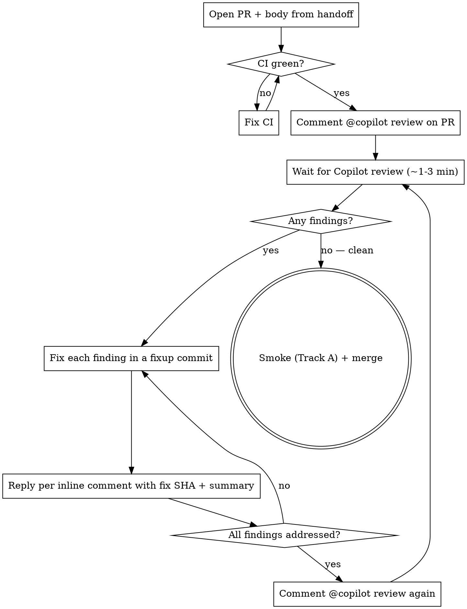

# Copilot review loop (per-PR)

> **STATUS — Copilot is ADVISORY, never a gate.** The sole review gate is the
> independent general-purpose reviewer; its termination contract lives in
> [`review-record.md`](review-record.md) §"Termination contract". Copilot's output — present OR
> absent — never counts as a PASS on its own. This doc is the *how-to* for the advisory Copilot
> pass (useful where an adopter's Copilot works); it does not decide whether a phase may close.
>
> **Why it was demoted (measured, not assumed).** A review OBJECT being present is not evidence a
> review was PERFORMED. In one sampled batch, **every** Copilot review objects across a sampled batch of PRs are
> `state:COMMENTED` bodies reading *"Copilot was unable to review … quota limit"* — each has the
> right author (`copilot-pull-request-reviewer[bot]`) and a fresh `submitted_at`, and each is a
> non-review. Any terminator keyed on "a Copilot review object exists" would read all seven as a
> clean pass. So a Copilot object of ANY shape (findings, "no issues", or a failure body) is only
> advisory input; the gate is the independent reviewer's affirmative verdict + an empty coverage
> window (`review-record.md`). Absence, silence, and failure bodies all map to **UNVERIFIED**.

Every PR — stacked or not — is gated by the independent general-purpose reviewer on top of CI before merge, and **every finding is either fixed (with a visible audit trail) or explicitly deferred (with a reason)**. A Copilot pass MAY run alongside as advisory signal; the steps below describe it.

## Loop steps



> **The `"no — clean" → merge` edge above is the OLD, dishonest terminator — superseded.** Copilot
> returning no findings does not license a merge: it is indistinguishable from Copilot failing to
> review (the quota-failure case, 7/7 here). The merge gate is the independent reviewer's
> affirmative verdict with an empty coverage window (`review-record.md` §"Termination contract").
> Read this graph as the *advisory* Copilot pass only.

## Trigger format

### Default — directive prompt (RECOMMENDED)

Empirically, a bare `@copilot review` sometimes returns silently (Copilot "finished work" with no public review comment and no inline findings). A **directive prompt** that lists specific audit points consistently produces a substantive response — Copilot replies point-by-point with `file:line` references, raises actionable gaps, and may even push a fix commit when the gap is mechanical.

Template:

```
@copilot review

Please specifically audit:

1. <module / function / behavior to verify> at <file path / line range> — <what would be wrong if it's wrong>.
2. <next audit point with the same shape>
...

Report findings inline on the relevant lines. If nothing actionable, state that explicitly so we can merge with confidence.
```

Aim for 4-8 audit points covering: the new module's core invariant, every cross-cutting concern (atomicity / cycle / race), every CONTESTED design decision from the brainstorm, every locked-but-flagged risk in the spec, any test that "looks right" but might be tautological. The last sentence ("state explicitly if nothing actionable") matters — without it Copilot may stay silent on a clean PR and you can't tell silent-clean from silent-failed.

### Bare trigger — fallback only

```
@copilot review
```

Use only when the PR is so small that a directive prompt would be cargo-cult (1-line typo fix, mechanical rename). Body must be exactly the trigger; no other prose — Copilot's parser is conservative about preamble.

## Fixup commit conventions

- **One fixup commit per Copilot review round** (not per finding). Commit message: `fix(<scope>): address GitHub Copilot review findings on PR #<N> (<summary>)`. Body lists `Fx -` rows mapping each finding to the change.
- **Never amend or squash the fixup history.** Copilot will re-read at the next `@copilot review`; reviewers will see the round-by-round arc.
- **Add regression tests for any CRITICAL / production-broken finding** in the same commit. Unit tests that passed because the bug was masked by an injected fake are blind spots — the test must exercise the production default.

## Per-finding inline reply format

After the fixup commit is pushed, reply to **every** Copilot inline comment (no exceptions, including the ones graded "low confidence"). The reply lives in the same comment thread so future readers + the next `@copilot review` see the audit trail.

**Fixed:**
```
Fixed in `<short SHA>` (Fx). <one-sentence summary of what changed and why>.
```

**Deferred:**
```
**Deferred** (`<short SHA>` Fx). <reason>. <tracking link or "tracked as backlog item">.
```

`Fx` is the row-label from the fixup commit body. Always link both the SHA and the row so the reader can jump from comment → commit body → diff.

### Why reply per finding (not a summary PR comment)

- Copilot threads each finding individually; a top-level PR comment doesn't dismiss the inline thread, so the next review round sees them as "open."
- User scanning the PR sees the fix inline with the original concern. No mental cross-reference between a summary table and a diff.
- The `in_reply_to` API call (`POST /repos/{o}/{r}/pulls/{n}/comments/{cid}/replies`) costs ~1 second per finding — total under a minute for a typical 8-12 finding review.

## Looping rule

Re-trigger `@copilot review` after every fixup-commit round, no matter how small. Two practical reasons:

1. **Fix introduced a new finding** — common when fixing a Zod schema gap or renaming a field; downstream callers may not have been migrated.
2. **Copilot graded the fix** — even a "still has a minor concern" follow-up is signal the user should see before merge.

Copilot's response never terminates the gate — it is advisory. The loop's terminator is the
independent reviewer's contract in `review-record.md` §"Termination contract": an **affirmative**
clean verdict over a coverage window that reaches HEAD. A Copilot "no actionable issues" reply is
useful signal to fold into the fixups, not a licence to merge; a Copilot failure body (quota/error)
is **UNVERIFIED**, not "0 findings".

**Hard round cap: 3 re-triggered rounds maximum.** The loop does not converge on its own — every fixup adds new text, and new text is fresh nitpick surface (observed: a prose PR ran 10 → 5 → 1 → 1 → 4 findings across five rounds; both real bugs surfaced by round 2). After round 3: remaining CRITICAL/IMPORTANT findings are fixed WITHOUT re-triggering another review; remaining minor findings are reply-deferred in-thread (`Deferred by round-cap: logged as S3 follow-up`) and the PR proceeds to the user's merge decision. This is a loop guard independent of reviewer judgment — never "just one more round."

## When to skip the loop

| Situation | Skip? |
|---|---|
| Pure docs-only PR (no `.ts` / `.py` / `.go` etc.) | OK to skip; flag in PR body |
| Trivial 1-line fix that doesn't touch security / state / DB | OK to skip; flag in PR body |
| User explicitly says "merge it, skip Copilot" | OK to skip; record reason in PR body |
| Copilot advisory pass returned findings | Fold them into the fixups; the independent reviewer still gates. Never merge on Copilot's say-so alone. |
| Copilot returned nothing, a "no issues" reply, OR a failure body (quota/billing/error) | **All three are UNVERIFIED for Copilot — not "0 findings", not "clean".** The independent reviewer is the gate regardless; dispatch it per `review-record.md`. Record the Copilot outcome verbatim in the PR-comment evidence (e.g. "Copilot: quota-limited, no review performed"), never as "reviewed: 0 findings". |
| Phase delivery PR (any non-trivial feature) | **MANDATORY — never skip** |
| Stacked PR where base is a feature branch | **MANDATORY — same as standalone** |

## Copilot stand-in when billing-blocked

GitHub Actions billing-paused (`The job was not started because recent GitHub Actions payments have failed or your spending limit needs to be increased`) also blocks Copilot's review job because Copilot runs on Actions infrastructure. Typical failure mode: the **first** `@copilot review` returns inline findings (the job had already spun up before billing hit), but every **subsequent** `@copilot review` errors out silently — leaving the loop stuck "waiting for round 2".

When that happens:

1. **Treat the 1st-pass findings as the standard 1st round.** Address every inline comment per the per-finding-reply protocol above. Fixup commits with `Fx-NN` labels. Re-trigger `@copilot review` once to confirm billing is still blocked (don't assume — sometimes it intermittently works).
2. **Dispatch an independent general-purpose reviewer (per `references/reviewer-brief.md`) as the 2nd-pass stand-in.** Brief it with:
    > "Copilot's 2nd pass is blocked by external infra (GitHub Actions billing). You are the independent 2nd reviewer for fixup commit `<sha>` on PR #<N>. Verify each Fx label actually addresses its 1st-round Copilot finding correctly, AND spot-check for regressions the fixup might have introduced (type safety / immutability / new dead code / test coverage gaps). Report CRITICAL / IMPORTANT / MINOR / NIT with file:line."
3. **Apply that subagent's findings** before merging — same standard as Copilot's findings would have been. Per-finding reply not strictly required (no Copilot thread to reply *to*), but record what was fixed + which SHA in the PR body or in the journal.
4. **In the PR body**, note the stand-in arrangement:
   > Copilot 2nd-pass blocked by Actions billing. An independent general-purpose reviewer stood in — found `<N>` IMPORTANT items, resolved in `<sha>`. See the journal entry for this phase for full list.
5. **Loop the stand-in TWICE max** — once to surface findings, once to confirm the fixup is clean. Pass 1 = independent review against the fixup commit; pass 2 = re-loop the same prompt against the latest HEAD. **"APPROVED-CLEAN" is the CONTROLLER'S derived label, not the reviewer's verdict**: the stand-in outputs only a findings list (CRITICAL/IMPORTANT/MINOR/NIT with file:line); the controller derives APPROVED-CLEAN from "pass-2 report contains zero open CRITICAL/IMPORTANT findings" — never from an approval string the reviewer states about its own pass (per `review-record.md` dispatch constraint 6: verdicts are computed, never self-declared). If pass 2 surfaces something, fix + commit and dispatch a fresh pass-2 attempt; if the loop fails to close in 3 fixup cycles, surface to the user — likely a design-level issue the stand-in is gesturing at.

The PR can merge once the stand-in's pass-2 findings list derives to APPROVED-CLEAN (zero open CRITICAL/IMPORTANT) AND the local test-evidence comment is posted on the PR (per `ci-cd-gates.md` §"Posting test evidence"). The Copilot loop closure rule ("clean OR user signs off") is satisfied because (a) 1st-pass findings are all addressed + (b) the pass-2 findings list is clean (the equivalent of Copilot's "no actionable issues" re-trigger reply).

**Merge-readiness statement to include in the PR-comment evidence** (matches the format in `ci-cd-gates.md` §"Posting test evidence"): `Ready for merge: stand-in pass 1 → N findings → resolved in <SHA>; pass 2 → APPROVED-CLEAN; R5 green.`

## Stacked PR caveat

If the PR is stacked on another feature branch (base != `main`), Copilot reviews the **head-vs-base** diff, which is exactly what you want — it focuses on the new commits, not on the inherited base.

After base merges and the PR auto-retargets to `main`, **do not re-trigger** unless new commits land — the diff content is identical, only the base ref changed.

## Anti-patterns

- ❌ Triggering `@copilot review` before CI runs → Copilot can't see green CI; doesn't change findings but signals churn.
- ❌ Replying with "fixed" but without the SHA or the Fx label → next round of `@copilot review` re-flags the same issue because the thread looks unresolved.
- ❌ Amending the fixup commit after Copilot reads it → review thread points at a dead SHA.
- ❌ Marking a finding "won't fix" without a deferred-reason reply → reviewer can't tell if it was intentional or missed.
- ❌ Skipping the loop on a stacked PR because "Copilot already reviewed the parent" — stacked PRs add NEW commits that the parent review never saw.
- ❌ **Treating the presence of a Copilot review object as proof a review happened** — the headline defect described above. A `state:COMMENTED` object with the right author and a fresh `submitted_at` can be a "unable to review … quota limit" failure body (7/7 here). Presence ≠ performed. Only the independent reviewer's affirmative verdict gates.
- ❌ **Trusting the directive prompt (the "state explicitly if nothing actionable" line) to make silence safe** — that puts the mitigation in the *prompt*, asking Copilot to self-declare, when the fix belongs in the *assertion*: the gate must require an affirmative verdict from the independent reviewer, not hope Copilot speaks. A prompt cannot force a quota-blocked bot to answer.
- ❌ Using the bare `@copilot review` trigger on a non-trivial PR — Copilot may finish silently. (Advisory only now; the independent reviewer gates regardless.)
- ❌ Fabricating SHAs in per-finding replies — always paste a real `git log --oneline -1` SHA. Wrong SHAs leave the audit trail pointing at nothing and reviewers can't follow up.

## Tool / API reference

```bash
# Trigger review — comment mention (org repos with Copilot code review enabled)
gh pr comment <N> --body "@copilot review"

# Trigger review — reviewer request via API (REQUIRED on personal repos: the
# comment mention silently does nothing there; verified with a 20+ minute wait and no response)
gh api repos/{owner}/{repo}/pulls/<N>/requested_reviewers \
  -f 'reviewers[]=copilot-pull-request-reviewer[bot]'
# Re-request after each fixup round with the same call.

# List inline review comments (id / path / line / body)
gh api repos/{owner}/{repo}/pulls/<N>/comments --jq '.[] | {id, path, line, body: .body[0:200]}'

# Reply to a specific inline comment
gh api -X POST repos/{owner}/{repo}/pulls/<N>/comments/<cid>/replies -f body="Fixed in \`<sha>\` (Fx). <summary>."

# Confirm Copilot's latest formal review (state / commit oid / submittedAt)
gh pr view <N> --json reviews --jq '.reviews | map({state, author: .author.login, submittedAt, commit: .commit.oid})'

# List Copilot's top-level PR comments (used when Copilot replies without a formal review object)
gh api repos/{owner}/{repo}/issues/<N>/comments --jq '.[] | select(.user.login=="Copilot") | {created_at, body: .body[0:300]}'
```

## After triggering — actually wait + check

**The single biggest bug in running this loop is "fire and forget."** Copilot takes 1-3 minutes to respond; if you trigger and immediately move on, you forget to come back, the user thinks the loop closed silently, and the next phase starts on top of unreviewed work. **You MUST poll for the response and confirm-or-fix before moving on.**

Use a background `until` loop that exits as soon as Copilot's comment is detected, then act on the result:

```bash
# Filter by created_at > <trigger time> to ignore prior Copilot comments
# in the same thread. Tune the timestamp to seconds after you triggered.
TRIGGER_TS="$(date -u +%Y-%m-%dT%H:%M:%SZ)"
until [[ $(gh api repos/{owner}/{repo}/issues/<N>/comments \
    --jq "[.[] | select(.user.login==\"Copilot\" and (.created_at > \"$TRIGGER_TS\"))] | length") -gt 0 ]]; do
  sleep 30
done
gh api repos/{owner}/{repo}/issues/<N>/comments \
  --jq '[.[] | select(.user.login=="Copilot")] | last | .body'
```

Run that as a background bash command (with `run_in_background: true`). The harness fires a notification the moment the loop exits — you act on Copilot's response in the same conversation turn, not later.

Why a TIMESTAMP filter instead of polling for ANY Copilot comment: on PRs with multiple round-trips, you'll trigger the same loop body 3+ times; without a timestamp filter the second `until` exits instantly because the FIRST round's comment is still there. Always filter by `created_at > <trigger time>`.

Why `state == "completed"` events alone are insufficient: Copilot sometimes "finishes work" without posting a comment (see the bare-trigger anti-pattern above). Watch for the COMMENT, not the EVENT.

## Findings audit row in handoff doc

After the loop closes, the handoff doc's §6 "Findings + known limits" section gains a row tagged `Copilot review (N findings, all addressed)` so the post-merge audit shows the loop ran.
